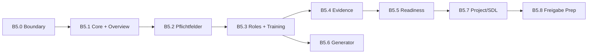

# B5.0 — Employee File Functional Build Boundary

**Gate:** B5.0 — Boundary definition only (no implementation)  
**Status:** **OPEN** — awaiting acceptance of boundary before B5.1  
**Date:** 2026-06-05  
**Branch:** `b3-tool2-migration`  
**App root:** `cert-expert-certification-os/apps/certification-os/`  
**Active module:** `modules/03-mitarbeiterakte-tool-2/`

---

## 1. B5 objective

Evolve Tool 2 from a **document generator** into a **controlled employee file / workforce readiness block** (Mitarbeiterakte) inside the Certification OS scaffold — without uncontrolled feature expansion.

B5 is gated, slice-based, and evidence-driven. Each slice has explicit acceptance criteria and closure evidence before the next slice starts.

**Functional north star:** An operator can see employees, maintain a minimal employee profile, understand required fields and evidence gaps, assign roles/overlays, track employee-specific training/instruction status, prepare (not auto-approve) release, and generate a Standardpersonalakte from real Hetzner templates.

---

## 2. Authoritative fachliche sources (inputs to B5)

These artefacts define *what* to build. They are **not** implemented by B5.0.

| Artefact | Role in B5 |
|----------|------------|
| `TOOL_2_EMPLOYEE_FILE_REQUIREMENTS_V1` | Core employee file requirements |
| `EMPLOYEE_FILE_GENERATOR_REQUIREMENTS_V1` | Generator / Standardpersonalakte requirements |
| `EMPLOYEE_FILE_READINESS_RULES_V1` | Readiness, blocker, ampel rules |
| `TOOL_2_EMPLOYEE_FILE_DEVELOPER_BACKLOG_V1` | Prioritised backlog items |
| `TOOL_2_EMPLOYEE_FILE_FUNCTIONAL_DESIGN_V1` | Functional flows (not final UI design) |
| `CERT_EXPERT_MVP_SCOPE_BOUNDARY_V1` | MVP cut line |

**In-repo anchors (today):**

| Document | Use |
|----------|-----|
| `docs/02-acceptance/ACCEPTANCE_BASELINE.md` | EC-01–EC-10 mapping |
| `docs/01-tool-2-handover/EXISTING_CODE_MAPPING.md` | Code ↔ capability map |
| `docs/00-system-context/PHASE_1_BOUNDARY_CONFIRMATION.md` | Passive module rules |
| `docs/03-controls/B3_5_*`, `B4_1_*`, `B4_2_*` | Closed gates + carried-forward controls |

> **Note:** Named `*_V1` artefacts may live outside this repo (user briefing / HQ). B5.1+ must trace requirements to those artefacts when available; until then, EC/T2-ACC mapping in-repo is the interim source of truth.

---

## 3. Current baseline (post B4.2)

| Area | Status |
|------|--------|
| Hetzner template storage | **Closed** (B3.5) |
| `/api/templates`, Upload Admin roles/appointments | **Closed** (B4.1) |
| Employee queue + localStorage persistence | **Working** (B2 T2-BUG-02) |
| Role/appointment dropdowns from Hetzner | **Working** (B3.5 R3) |
| DOCX/ZIP generation (GetObject) | **Working** (B3.5 R3) |
| EC-09 manual compare | **Closed with observations** (B4.2) |
| `evidence/`, `readiness-rules/`, `project-link/` | **Boundary-only README** |
| EC-03–08, EC-10 | **Not started** in migrated app |

---

## 4. B5 in-scope (controlled functional build)

Only items below, delivered through **approved B5.x slices**. No slice may expand scope without a new boundary gate.

| # | Functional area | EC / T2-ACC anchor | Target submodule(s) |
|---|-----------------|-------------------|---------------------|
| 1 | Mitarbeiterübersicht / employee overview | EC-01, T2-ACC-01 | `employee-file/` |
| 2 | Mitarbeiterprofil / employee profile | EC-01, EC-02 | `employee-file/` |
| 3 | Pflichtfelder / required fields surfacing | EC-02, T2-ACC-02 | `employee-file/validations/` |
| 4 | Nachweisstatus / evidence status (employee-specific) | EC-03, EC-04, T2-ACC-03–07 | `evidence/` (minimal first slice) |
| 5 | Employee evidence upload/storage (Hetzner, employee-scoped keys) | EC-03 | `evidence/` + existing `template-storage` patterns |
| 6 | Standardpersonalakte generation (retain + harden) | EC-09, T2-ACC-13–14 | `employee-generator/` |
| 7 | Rollen + Zusatzrollen (Grundrolle + overlays from Hetzner) | EC-06, T2-ACC-08–09 | `employee-file/`, `roles/` |
| 8 | Schulung / Unterweisung status (employee-specific only) | EC-06 partial, generator selections | `employee-file/` |
| 9 | SDL / project assignment (minimal reference interface) | EC-07, T2-ACC-10–11 | `project-link/` (minimal fields only) |
| 10 | Freigabe **preparation** (no auto-approval) | EC-10, C-01–C-06 | `controls/`, `readiness-rules/` |
| 11 | Audit-Readiness status + offene Punkte (employee-level) | EC-08, T2-ACC-15 | `readiness-rules/` (minimal rules first) |

**Infrastructure reuse (in scope, no redesign):**

- Hetzner `lib/template-storage.ts` for templates
- Existing `employee-queue-storage.ts` as interim persistence until B5.1 defines upgrade path
- Existing `generate-employee-docs.ts` pipeline

---

## 5. B5 out-of-scope (hard boundary)

| Exclusion | Rationale |
|-----------|-----------|
| Tool 1 migration / `/api/standard-models` | Separate external branch |
| Full LMS | Module `05-schulungen-unterweisungen/` passive |
| Full Schulungskalender | Out of MVP |
| Full Projektakte | Module `02-projektakte/` passive |
| Full Unternehmensakte | Module `01-unternehmensakte/` passive |
| Full dashboard / ZKM / Prüfvermerke | Module `00-dashboard/` passive |
| Deep relational data model / new DB | B5 uses minimal extensions only |
| Final UI design system | Functional flows only |
| Pricing, customer portal, partner portal | Product scope |
| New storage architecture | Hetzner boundary closed in B3.5 |
| Fake templates, fake ZIP, fake EC-09 evidence | Evidence gates |
| Unchecked automatic Freigabe / auditfähig claims | EC-10 / HARD_CONTROLS |
| Passive module **full** implementation in one slice | Must be sliced |

---

## 6. B5 slice plan (B5.1 – B5.8)

Slices are sequential gates. **Do not start B5.n+1 until B5.n is closed** (or closed with documented open controls).

### B5.1 — Employee File Core & Overview Shell

**Goal:** Replace “generator queue only” with a minimal **employee file** concept: overview list + profile shell + durable persistence strategy (extend localStorage or approved minimal store — no new DB).

| Acceptance criteria | |
|---------------------|---|
| AC-1 | Mitarbeiterübersicht lists all employee files with name, role, status summary |
| AC-2 | Mitarbeiterprofil view opens from overview (read-first) |
| AC-3 | Create / edit / delete employee file without data loss on reload |
| AC-4 | Existing generator queue behavior not regressed (T2-BUG-02) |
| AC-5 | `npm run build` PASS |

| Evidence | |
|----------|---|
| Screenshot: overview with ≥1 employee | |
| Screenshot: profile shell | |
| Reload persistence check documented | |
| `B5_1_*_REPORT.md` | |

**Maps to:** EC-01 foundation, functional areas 1–2.

---

### B5.2 — Pflichtfelder & Required-Field Surfacing

**Goal:** Surface missing required fields on profile/overview; no full ampel yet.

| Acceptance criteria | |
|---------------------|---|
| AC-1 | Required fields defined per MVP rules (from REQUIREMENTS_V1 / EC-02) |
| AC-2 | UI shows which Pflichtfelder are missing per employee |
| AC-3 | Form validation aligned with surfaced rules |
| AC-4 | No false “complete” state when required fields empty |

| Evidence | Missing-field screenshot, validation notes, build PASS, report |

**Maps to:** EC-02, functional area 3.

---

### B5.3 — Roles, Overlays & Employee-Specific Training Selection

**Goal:** Harden Grundrolle + Zusatzrollen from Hetzner templates; employee-specific doc selection stable across edit.

| Acceptance criteria | |
|---------------------|---|
| AC-1 | Roles/appointments from `/api/templates` (not static demo config) |
| AC-2 | T2-BUG-03 / T2-BUG-08 behaviors preserved or improved |
| AC-3 | Employee profile shows assigned role + overlay docs |
| AC-4 | Selection state persists with employee file |

| Evidence | UI screenshots, API template proof, regression notes, report |

**Maps to:** EC-06, functional areas 7–8.

---

### B5.4 — Evidence Status & Offene Unterlagen (minimal)

**Goal:** First **minimal** `evidence/` implementation: status enum per required evidence item (vorhanden/fehlt/abgelaufen/zu prüfen/nicht relevant) — mark/upload employee-specific evidence to Hetzner under controlled key prefix.

| Acceptance criteria | |
|---------------------|---|
| AC-1 | Evidence types list per employee (derived from role/overlay rules — minimal set) |
| AC-2 | Manual status mark OR upload to Hetzner (real files only) |
| AC-3 | Offene Unterlagen list generated from gaps |
| AC-4 | No fake evidence; no norm auto-interpretation |

| Evidence | Hetzner object listing, offene Punkte screenshot, report |

**Maps to:** EC-03, EC-04, functional areas 4–5.

---

### B5.5 — Readiness & Blocker Display (employee-level, minimal rules)

**Goal:** First **minimal** `readiness-rules/` evaluator: grün/gelb/rot/grau from Pflichtfelder + evidence only (no project context yet).

| Acceptance criteria | |
|---------------------|---|
| AC-1 | Per-employee readiness status computed from declared rules |
| AC-2 | Rot blocker overrides gelb/grün |
| AC-3 | No unchecked “auditfähig” or Freigabe claim (EC-10) |
| AC-4 | `review_required` flag when fachliche Prüfung pending |

| Evidence | Status screenshots for 3 fixture employees, rule doc reference, report |

**Maps to:** EC-05, EC-08, functional area 11 (partial).

---

### B5.6 — Standardpersonalakte Generation Hardening

**Goal:** Retain working generator; address carried-forward observations where in slice scope (not full T2-BUG-09 redesign unless accepted).

| Acceptance criteria | |
|---------------------|---|
| AC-1 | ZIP generation from Hetzner templates still works |
| AC-2 | EC-09 baseline not regressed (compare new ZIP to prior baseline method) |
| AC-3 | Profile “generate” action uses employee file state |
| AC-4 | Only selected role/appointment docs included |

| Evidence | New baseline ZIP path, EC-09 review notes, build PASS, report |

**Maps to:** EC-09, functional area 6.

---

### B5.7 — SDL / Project Minimal Interface

**Goal:** First **minimal** `project-link/` fields: Projekt-ID, SDL reference (IDs only, no Projektakte build).

| Acceptance criteria | |
|---------------------|---|
| AC-1 | Employee profile stores optional project/SDL reference IDs |
| AC-2 | Readiness can scope to linked context (minimal rule hook) |
| AC-3 | No Projektakte duplication |

| Evidence | Profile screenshot with IDs, readiness scoping note, report |

**Maps to:** EC-07, functional area 9.

---

### B5.8 — Freigabe Preparation & Controls

**Goal:** Freigabe **preparation** workflow only — explicit human gate, audit trail stub in `controls/`.

| Acceptance criteria | |
|---------------------|---|
| AC-1 | “Prepare release” captures checklist state, does not auto-approve |
| AC-2 | EC-10: UI never implies unchecked auditfähig |
| AC-3 | Release blocked when rot or missing Pflichtfelder |

| Evidence | Blocked-release screenshot, controls checklist doc, report |

**Maps to:** EC-10, functional area 10.

---

## 7. Slice dependency graph

**Parallel exception:** B5.6 may start after B5.3 if generator hardening does not depend on B5.4/5.5 — prefer sequential unless gate approves parallel.

---

## 8. Carried-forward controls (unchanged by B5.0)

| Control | B5 handling |
|---------|-------------|
| `logoFile` persistence | **Carry forward** — optional; may address in B5.1+ if scoped; not MVP-blocking |
| T2-BUG-09 date locale in DOCX | **Carry forward** — optional in B5.6 only if explicitly scoped |
| Tool 1 APIs (`/api/standard-models`) | **Out of scope** — Upload Admin decoupled (B4.1) |
| Full LMS | **Out of scope** |
| Full project file | **Out of scope** — B5.7 minimal IDs only |
| Full dashboard | **Out of scope** |

---

## 9. B5.0 gate compliance

| Check | Result |
|-------|--------|
| B5.0 defines boundary only | **Yes** — no code in this step |
| B5.1 started | **No** |
| Tool 1 touched | **No** |
| Passive modules fully implemented | **No** — sliced from B5.4+ |
| Fake evidence | **No** |

---

## 10. Gate recommendation

### **A) Accept B5.0 boundary → open B5.1 as first implementation slice**

**Recommended first slice:** **B5.1 — Employee File Core & Overview Shell**

Rationale: All later slices (Pflichtfelder, evidence, readiness, SDL, Freigabe) require a stable employee file entity and overview/profile shell. Current `employee-queue-storage` is a generator queue, not a workforce block.

**B5.1 entry checklist:**

1. User accepts this boundary document (or records corrections).
2. Attach / confirm fachliche `*_V1` artefacts in workspace for traceability.
3. Branch remains `b3-tool2-migration` (or successor) with B2–B4.2 commits pushed.
4. Explicit gate message: **“Start B5.1”** — no implementation before that.

**Not recommended now:**

- **Skip to B5.4 evidence** without B5.1–B5.3 — no stable employee file model.
- **Implement in B5.0** — boundary-only gate.

---

## 11. Related closed gates

| Gate | Report |
|------|--------|
| B3.5 | `B3_5_STORAGE_ACTIVATION_RETEST_REPORT.md` |
| B4.1 | `B4_1_UPLOAD_ADMIN_COMPLETION_REPORT.md` |
| B4.2 | `B4_2_RESIDUAL_EVIDENCE_CONTROLS_REPORT.md` |
