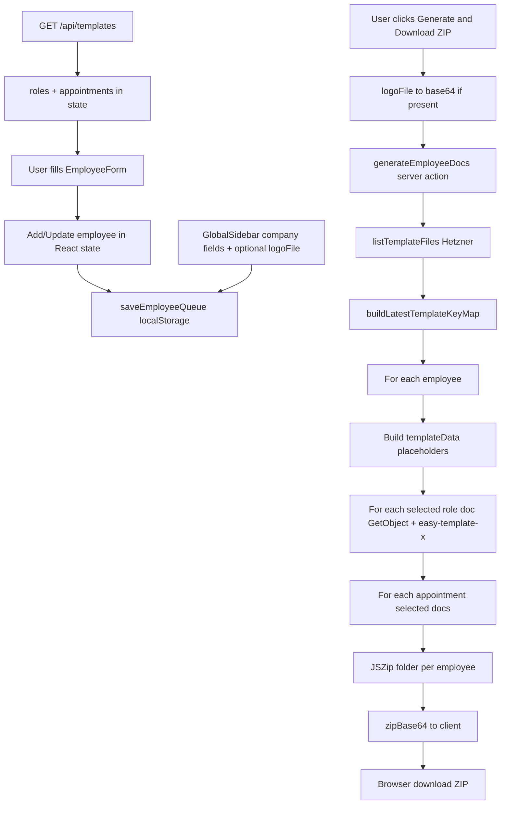

# B5.1 Employee File Current-State Inventory

**Gate:** B5.1 — Current-state inventory and analysis only  
**Status:** **OPEN** — inventory complete; **does not authorize implementation**  
**Date:** 2026-06-05  
**Branch:** `b3-tool2-migration`  
**Prerequisite commit:** `e31693a` (B5.0 boundary)  
**App root:** `cert-expert-certification-os/apps/certification-os/`  
**Inspection method:** Static read of migrated codebase (no code changes, no build run)

---

## 0. Control Decision

**B5.1 is an inventory-only control.**

| Decision | Detail |
|----------|--------|
| Authorized | Read codebase; document current Tool 2 state vs B5.0 target |
| Not authorized | Code changes, refactor, UI, data model, routes, storage logic, implementation |
| Next gate | B5.2 — Employee File Object Boundary (planning only until explicitly opened) |

B5.0 defined the functional redesign boundary. B5.1 records **what exists today** before any redesign work.

---

## 1. Source Basis

### 1.1 Inspected application paths (2026-06-05)

| Path | Role |
|------|------|
| `app/employee-automation/page.tsx` | Route re-export |
| `app/actions/generate-employee-docs.ts` | Server action re-export |
| `app/api/templates/route.ts` | Tool 2 template listing |
| `app/api/uploads/route.ts` | Shared template upload (roles/appointments used by Tool 2) |
| `app/api/uploads/folder/route.ts` | Shared folder create |
| `app/api/preview/route.ts` | Ephemeral DOCX preview (not wired to Tool 2 page) |
| `app/api/standard-models/route.ts` | Tool 1 only — noted for separation |
| `app/page.tsx`, `components/layout/Navbar.tsx` | Entry points |
| `modules/03-mitarbeiterakte-tool-2/employee-file/*` | Tool 2 UI, types, validation, persistence |
| `modules/03-mitarbeiterakte-tool-2/employee-generator/generate-employee-docs.ts` | ZIP/DOCX pipeline |
| `modules/03-mitarbeiterakte-tool-2/document-output/*` | Preview components (unused in main flow) |
| `modules/03-mitarbeiterakte-tool-2/roles/employee-config.ts` | Static demo data (unused at runtime) |
| `modules/03-mitarbeiterakte-tool-2/roles/admin/UploadsPage.tsx` | Upload Manager (template admin) |
| `modules/03-mitarbeiterakte-tool-2/evidence/README.md` | Boundary placeholder |
| `modules/03-mitarbeiterakte-tool-2/readiness-rules/README.md` | Boundary placeholder |
| `modules/03-mitarbeiterakte-tool-2/project-link/README.md` | Boundary placeholder |
| `lib/template-storage.ts`, `lib/hetzner-s3-client.ts`, `lib/sanitize.ts` | Hetzner storage layer |
| `components/ui/*` | Shared form primitives used by Tool 2 |
| `tsconfig.json` | Path aliases for Tool 2 modules |

### 1.2 Inspected control / acceptance docs

| Document | Use |
|----------|-----|
| `docs/03-controls/B5_0_TOOL_2_FUNCTIONAL_REDESIGN_BOUNDARY.md` | Target comparison |
| `docs/02-acceptance/ACCEPTANCE_BASELINE.md` | EC-01–EC-10 status |
| `docs/01-tool-2-handover/EXISTING_CODE_MAPPING.md` | Legacy map, T2-BUG table |
| `docs/03-controls/B4_2_RESIDUAL_EVIDENCE_CONTROLS_REPORT.md` | EC-09, logoFile carry-forward |
| `docs/03-controls/B3_5_STORAGE_ACTIVATION_RETEST_REPORT.md` | Hetzner activation, T2-BUG retest |
| `docs/02-acceptance/B2_STEP_REPORT.md` | B2 bugfix closure |

### 1.3 Explicitly not inspected as runtime Tool 2

| Path | Reason |
|------|--------|
| `bots/legacy_tools/.../document_creater_tool_employee_file_creater_tool1_2/` | Frozen legacy; migrated app is source of truth |
| `app/model-creator/*`, `app/actions/send-model-entries.ts` | Tool 1 — out of Tool 2 scope |
| `.env.local` | Secrets — not read |

---

## 2. Current Tool 2 Location Map

| Area | File / folder | Current purpose | Notes |
|------|---------------|-----------------|-------|
| **Route** | `app/employee-automation/page.tsx` | Re-exports `EmployeeAutomationPage` | Single Tool 2 URL |
| **Main page** | `modules/.../employee-file/EmployeeAutomationPage.tsx` | Orchestrates form, table, sidebar, generate ZIP | Generator-centric layout |
| **Form** | `modules/.../employee-file/EmployeeForm.tsx` | Add/edit employee + doc checklists | 780 lines; queue semantics |
| **List** | `modules/.../employee-file/EmployeeTable.tsx` | Paginated “Employee Queue” | Search, edit, double-click delete |
| **Globals** | `modules/.../employee-file/GlobalSidebar.tsx` | Company metadata + logo dropzone | Applied to all employees in batch |
| **Barrel** | `modules/.../employee-file/index.ts` | Exports form, table, sidebar | `@/components/employee` alias |
| **Types** | `modules/.../employee-file/types/employee.ts` | `Employee`, `Role`, `Appointment`, `GlobalProperties` | `@/lib/types/employee` |
| **Validation** | `modules/.../employee-file/validations/employee-form.ts` | Zod schemas | `@/lib/validations/employee-form` |
| **Persistence** | `modules/.../employee-file/employee-queue-storage.ts` | localStorage queue snapshot | Key: `cert-expert-tool2-employee-queue-v1` |
| **Date utils** | `modules/.../employee-file/utils/date.ts` | Paste/parse helpers (B2) | `@/lib/utils/date` |
| **Generator** | `modules/.../employee-generator/generate-employee-docs.ts` | Server action: Hetzner → DOCX → ZIP | `"use server"` |
| **Action export** | `app/actions/generate-employee-docs.ts` | Re-export for Next.js | Thin wrapper |
| **Templates API** | `app/api/templates/route.ts` | GET roles + appointments from Hetzner | Filters `roles/`, `appointments/` only |
| **Storage lib** | `lib/template-storage.ts` | List/upload/delete/get Hetzner objects | Categories: roles, appointments, standard-models |
| **Upload admin** | `modules/.../roles/admin/UploadsPage.tsx` | `/uploads` UI | Admin for all 3 categories; Tool 2 consumes roles/appointments |
| **Demo config** | `modules/.../roles/employee-config.ts` | Static `ROLES` / `APPOINTMENTS` arrays | **Not imported** by runtime Tool 2 |
| **Preview (orphan)** | `modules/.../document-output/DocumentPreview.tsx` | DOCX preview client | **Not imported** by EmployeeAutomationPage |
| **Preview API** | `app/api/preview/route.ts` | In-memory 5 min TTL store | Used only if DocumentPreview mounted |
| **Scaffold placeholders** | `evidence/`, `readiness-rules/`, `project-link/` | README only | No runtime code |
| **Shared UI** | `components/ui/DatePicker.tsx`, `Select`, `MultiSelect`, etc. | Form controls | DatePicker B2 fixes present |
| **Navigation** | `app/page.tsx`, `Navbar.tsx` | Links to “Employee Generator” | Generator naming |

---

## 3. Current Functional Inventory

### 3.1 Employee input

- **Add:** `EmployeeForm` → `handleAddEmployee` appends to `employees` array with `crypto.randomUUID()`.
- **Edit:** Table “Edit” loads employee into form via `editingEmployee` + `formKey` remount.
- **Delete:** Double-click confirm on trash icon; removes from array.
- **Fields captured:** fullName, birthday, startDate, roleId, appointmentIds, roleType, trainingHours, guardIDNumber, employeeIDNumber, useGuardAsEmployeeId, selectedRoleDocIds, selectedAppointmentDocIds.
- **UX framing:** “New Employee Registration” / “Add Employee” — registration for doc batch, not “open employee file.”

### 3.2 Employee save / reopen

- **Save:** Implicit — `useEffect` persists `{ employees, globalProps }` to localStorage on change after hydration.
- **Reopen:** Page load calls `loadEmployeeQueue()`; employees and globalProps restored.
- **Scope:** Browser-local only; no server DB, no multi-device, no employee-file identity beyond queue entry.
- **logoFile:** **Not persisted** — separate React state; only merged into `globalProps.companyLogo` at generate time (B4.2 carry-forward).

### 3.3 Training / instruction selection (document-centric)

- **Primary role:** Single select from Hetzner `/api/templates` roles.
- **Overlays:** Multi-select “Appointments” (legacy name for Zusatzrollen / overlay doc groups).
- **Document selection:** Per-role “Core Documents” and per-appointment “Overlay Documents” checklists with Select All / Deselect All (T2-BUG-08 fixed in code).
- **Auto-select behavior:** Changing role auto-selects all role docs (with edit-mode guards for T2-BUG-03). Changing appointments merges doc selections.
- **Semantic gap:** Selection chooses **which DOCX templates to include in ZIP** — not person-specific Schulung/Unterweisung **status** (due/completed/expired).

### 3.4 Group / batch logic

- **Batch queue:** Multiple employees in one list; one “Generate & Download ZIP” produces **one ZIP** with subfolders per employee name.
- **Employee groups (T2-BUG-06):** **Not present** — no group entity, no group-scoped generation.
- **Multiple SMA per DOCX (T2-BUG-05):** **Not present** — one employee context per template process call.

### 3.5 Document generation

- **Trigger:** `handleGenerate` in `EmployeeAutomationPage` when queue non-empty.
- **Input:** Full `employees[]`, `globalProps` (+ session logo as base64), `roles`, `appointments` from client state.
- **Server:** `generateEmployeeDocs` loops employees; for each, processes selected role/appointment DOCX from Hetzner via `easy-template-x`.
- **Placeholders injected:** Logo, FullName, Birthday, StartDate, RoleName, RoleType, TrainingHours, GuardIDNumber, EmployeeIDNumber, currentDate, company fields, DocVersion, DocDate, CreatedBy, ApprovedBy.
- **Date formatting:** `en-US` long format in output (`T2-BUG-09` carry-forward).

### 3.6 ZIP output

- **Structure:** `{employeeFullName}/{roleName}/*.docx` + `{employeeFullName}/{appointmentName}/*.docx`.
- **Delivery:** Base64 to client → Blob → browser download `employee-documents-{timestamp}.zip`.
- **EC-09:** Working with real Hetzner templates (B4.2 baseline review closed with observations).

### 3.7 Template loading

- **On mount:** `fetch("/api/templates")` → populates `roles`, `appointments` state.
- **API:** Lists Hetzner objects; parses `customId` for `roles/` and `appointments/`; builds folder/doc metadata.
- **Failure:** 503 if Hetzner env not configured; form shows loading spinner until `templatesLoaded`.

### 3.8 Upload / template management touchpoints

| Touchpoint | Tool 2 relationship |
|------------|---------------------|
| `/uploads` Upload Manager | **Indirect** — admin uploads role/appointment DOCX templates to Hetzner |
| `/api/uploads` POST/DELETE | Categories `roles`, `appointments` (also `standard-models` for Tool 1) |
| `/api/uploads/folder` | Create template folders |
| `lib/template-storage.ts` | Shared Hetzner adapter |
| Person-specific evidence upload | **Absent** |

### 3.9 Standard models touchpoints

- **`standard-models` category** exists in storage and Upload Manager.
- **Tool 2 generator** does **not** read `standard-models` — only `roles/` and `appointments/` prefixes in `generate-employee-docs.ts` and `/api/templates`.
- **Tool 1** (`/model-creator`, `/api/standard-models`) is separate; no runtime coupling in Tool 2 page.

---

## 4. Current Data Field Inventory

| Field / concept | Exists today? | Where found | Current use | B5 relevance |
|-----------------|---------------|-------------|-------------|--------------|
| `Employee.id` | Yes | `types/employee.ts` | UUID for queue row | Becomes employee-file key candidate |
| `fullName` | Yes | Employee type, form, generator | Display, ZIP folder name, `{FullName}` | Core profile |
| `birthday` | Yes | Form (required), generator | `{Birthday}` placeholder | Pflichtfeld |
| `startDate` | Yes | Form (required), generator | `{StartDate}` placeholder | Pflichtfeld |
| `roleId` | Yes | Form (required), table, generator | Links to Hetzner role folder | Grundrolle |
| `appointmentIds[]` | Yes | Form, generator | Overlay / Zusatzrolle doc groups | Additional roles (partial) |
| `selectedRoleDocIds[]` | Yes | Form, table badge, generator | DOCX inclusion filter | Output selection → future evidence/doc rules |
| `selectedAppointmentDocIds[]` | Yes | Form, table badge, generator | DOCX inclusion filter | Same |
| `roleType` | Yes (optional) | Form, generator | `{RoleType}` placeholder | Profile extension |
| `trainingHours` | Yes (optional) | Form, generator | `{TrainingHours}` string only | **Not** instruction status |
| `guardIDNumber` | Yes (optional) | Form, generator | `{GuardIDNumber}` | Identification |
| `employeeIDNumber` | Yes (optional) | Form, generator | `{EmployeeIDNumber}` | Identification |
| `useGuardAsEmployeeId` | Yes (optional) | Form | Sync guard → employee ID | UX helper |
| `GlobalProperties.*` | Yes | GlobalSidebar, storage, generator | Company + doc metadata placeholders | Company context for output |
| `companyLogo` (base64) | Partial | GlobalProperties type; set at generate | `{Logo}` in DOCX | Optional; not persisted from dropzone |
| First / last name split | No | — | — | May be needed for Pflichtfelder |
| Evidence items / status | No | `evidence/` README only | — | EC-03, EC-04 |
| Offene Unterlagen list | No | — | — | EC-04 |
| Readiness / ampel | No | `readiness-rules/` README | — | EC-05, EC-08 |
| Per-training dates / status | No | T2-BUG-07 | — | Person-specific instruction status |
| `groupId` / employee groups | No | T2-BUG-06 | — | Out of early B5 unless scoped |
| Project ID / SDL reference | No | `project-link/` README | — | EC-07 |
| Release preparation state | No | — | — | EC-10 |
| Audit open issues | No | — | — | EC-08 |
| `createdAt` / `updatedAt` | No | — | — | Employee-file lifecycle |
| `review_required` flag | No | HARD_CONTROLS C-01 | — | Future readiness |

---

## 5. Generator Logic Inventory

### 5.1 End-to-end flow (as implemented)

### 5.2 Generator-only characteristics

- Operates on **array of queue entries**, not a single employee-file workspace.
- No precondition checks (Pflichtfelder completeness, evidence, readiness).
- No per-employee generate — always batch all queued employees.
- Template paths: `roles/{roleId}/{fileName}`, `appointments/{appointmentId}/{fileName}`.
- Same `templateData` reused for every appointment doc (T2-BUG-10 risk: duplicate boilerplate across appointment files).

### 5.3 Non-generator logic in the same page

- Form validation (Zod) — input quality only.
- localStorage — queue persistence, not file system.
- Template fetch — dependency for dropdowns/checklists, not generation itself.

---

## 6. Evidence / Employee File Gap Analysis

Comparison against B5.0 functional areas:

| B5.0 area | Current state | Gap |
|-----------|---------------|-----|
| **1. Employee overview** | `EmployeeTable` labeled “Employee Queue”; name, role, start date, doc counts | No readiness summary, no open-issue count, no file-oriented navigation |
| **2. Employee profile** | Edit loads form at top of same page | No dedicated profile view; no read-first file workspace |
| **3. Required fields** | Zod requires fullName, birthday, startDate, roleId on submit | No Pflichtfeld surfacing on list/profile; no “complete” vs “incomplete” state |
| **4. Evidence status** | None | Full gap — EC-03, EC-04 |
| **5. Person-specific evidence storage** | None | Full gap; Hetzner used for templates only |
| **6. Standard employee file output** | ZIP generation working (EC-09) | Output exists but is center of UX; not subordinate to file state |
| **7. Roles + additional roles** | Single role + multi appointment overlays from Hetzner | Partial — doc selection, not role/evidence rule engine |
| **8. Training/instruction status** | `trainingHours` string; appointment = doc groups | No status enum, dates, or due/completed tracking (C-07) |
| **9. SDL/project interface** | None | Full gap — EC-07 |
| **10. Release preparation** | None | Full gap — EC-10 |
| **11. Audit-readiness / open issues** | None | Full gap — EC-08 |

**EC summary (migrated app, post-B2/B3.5/B4.2):**

| EC | Inventory assessment |
|----|---------------------|
| EC-01 | Partial — localStorage queue, not employee file |
| EC-02 | Partial — form validation only |
| EC-03–08, EC-10 | Not started |
| EC-09 | Implemented — real Hetzner ZIP |

---

## 7. Legacy Baggage

These patterns reflect **document-generator thinking** and must not drive the B5 redesign:

| Baggage | Manifestation |
|---------|---------------|
| **Queue semantics** | “Employee Queue”, “Add to queue”, “Ready to generate”, toast “added to queue” |
| **Single-page generator** | Form + table + batch generate on one scroll page |
| **Appointments = training** | UI label “Appointments / Overlays” maps to DOCX folders, not Unterweisung lifecycle |
| **Document checklists as primary UX** | Right panel “Core / Overlay Documents” is template inclusion, not evidence management |
| **Batch ZIP as success** | Primary CTA is “Generate & Download ZIP” for all employees |
| **Global sidebar for batch** | Company props + logo apply to entire queue session |
| **localStorage queue snapshot** | `EmployeeQueueSnapshot` — not versioned employee file |
| **Unused demo config** | `employee-config.ts` Software Engineer roles — dead file, legacy demo smell |
| **Generator date locale** | Hard-coded `en-US` long dates in output |
| **Orphan preview components** | `DocumentPreview` migrated but not integrated — generator has no preview step |
| **Naming: Employee Generator** | Home + navbar still say “Employee Generator” / “Employee Document Automation” |

---

## 8. Keep / Replace / Retire Initial Assessment

| Item | Keep / Replace / Retire / Unknown | Reason | Candidate later slice |
|------|-----------------------------------|--------|------------------------|
| `generate-employee-docs.ts` pipeline | **Keep** (harden) | EC-09 working; C-09 regression risk | B5.5 |
| Hetzner `template-storage` + `/api/templates` | **Keep** | Closed B3.5; runtime dependency | Reuse |
| `/api/uploads` template admin | **Keep** | B4.1; separate from person evidence | Out of employee-file slices |
| `Employee` type core fields | **Keep** (extend) | Valid capture surface | B5.2 |
| Zod `employeeFormSchema` | **Keep** (align) | Baseline validation | B5.3 |
| `employee-queue-storage` | **Replace** | Queue ≠ employee file | B5.2 |
| `EmployeeAutomationPage` layout | **Replace** | Generator-centric | B5.2+ |
| `EmployeeTable` as overview | **Replace** | Queue table ≠ Mitarbeiterübersicht | B5.2 |
| `EmployeeForm` doc checklists | **Replace** (reframe) | Template pickers → profile sections + rules | B5.3 |
| Queue / generate copy & CTAs | **Replace** | Legacy mental model | B5.2+ |
| `roles/employee-config.ts` | **Retire** | Unused demo data at runtime | Cleanup when convenient |
| `DocumentPreview` (unwired) | **Unknown** | Orphan — integrate or retire in output slice | B5.5 |
| UploadThing | **Retire** | Already removed | Closed |
| Evidence / readiness / project-link READMEs | **Replace** (implement later) | Placeholders only | B5.3, B5.4 |
| Tool 1 routes/APIs | **Keep separate** | Not Tool 2 | Out of scope |
| Shared `components/ui/*` | **Keep** | Reusable primitives | All slices |
| `logoFile` session-only | **Keep** (carry-forward) | Optional; B4.2 documented | Optional B5.5 |
| T2-BUG-09 en-US dates | **Keep** (carry-forward) | Known observation | Optional B5.5 |
| T2-BUG-05 multi-SMA per doc | **Unknown** | Not implemented; scope TBD | Backlog |
| T2-BUG-06 groups | **Unknown** | Not implemented | Backlog / confirm scope |
| T2-BUG-10 duplicate appointment content | **Keep** (carry-forward) | Code path unchanged | B5.5 if scoped |

---

## 9. Known Observations and Carry-Forwards

| ID | Observation | Status | Source |
|----|-------------|--------|--------|
| **logoFile persistence** | `logoFile` state not written to localStorage; `companyLogo` in persisted `globalProps` stays empty after reload | **CARRY FORWARD** — optional, not MVP-blocking | B4.2 §3 |
| **T2-BUG-09 date locale** | Generator uses `toLocaleDateString("en-US", { month: "long", ... })` for Birthday, StartDate, currentDate | **CARRY FORWARD** | B4.2 EC-09 review, `generate-employee-docs.ts` L47–51, L98–106 |
| **T2-BUG-10** | Same `templateData` for all appointment docs; duplicate boilerplate risk | **CARRY FORWARD** | EXISTING_CODE_MAPPING |
| **T2-BUG-05** | No multi-employee single DOCX | **Not implemented** | EXISTING_CODE_MAPPING |
| **T2-BUG-06** | No employee groups | **Not implemented** | EXISTING_CODE_MAPPING |
| **T2-BUG-07** | No per-training dates | **Not implemented** | EXISTING_CODE_MAPPING |
| **employee-config.ts** | Demo ROLES/APPOINTMENTS file exists but **zero runtime imports** | **Observation** — safe retire candidate | This inventory |
| **DocumentPreview orphan** | Component + `/api/preview` exist; not used on `/employee-automation` | **Observation** | This inventory |
| **B2 fixes present** | T2-BUG-01 paste, 02 localStorage, 03 edit doc preservation, 04 calendar, 08 select-all in code | **Closed in B2/B3.5 R3** | B2_STEP_REPORT, B3.5 R3 |
| **EC-09 baseline** | Real ZIP from Hetzner; text/structure review passed with observations | **Closed with observations** | B4.2 |
| **Hetzner misconfig** | `/api/templates` returns 503 without env vars | **Operational** | `templates/route.ts` |

---

## 10. B5.1 Out of Scope

- No code changes
- No UI redesign
- No data model definition or implementation
- No software architecture design
- No storage redesign (Hetzner template boundary closed)
- No Tool 1 redesign
- No full LMS, training calendar, project file, company file, or dashboard
- No fake evidence, templates, or ZIPs
- No B5.2+ implementation

---

## 11. Gate Criteria for Leaving B5.1

| # | Criterion |
|---|-----------|
| G-1 | This inventory document complete and accepted |
| G-2 | Tool 2 file map traceable to real paths in migrated app |
| G-3 | Generator vs employee-file gap explicitly documented against B5.0 |
| G-4 | Keep/replace/retire assessment recorded with candidate slices |
| G-5 | Carry-forwards (logoFile, T2-BUG-09, etc.) listed — no silent assumptions |
| G-6 | Explicit gate message before B5.2 (e.g. **“Start B5.2”**) |
| G-7 | No application code changed under B5.1 commit |

---

## 12. Recommendation for B5.2

**Open B5.2 — Employee File Object Boundary** as the next controlled slice.

### Why B5.2 next

The inventory confirms the **central missing primitive**: there is no employee-file entity or workspace—only a localStorage-backed generator queue. Evidence, readiness, SDL, and release preparation all require a stable object boundary before UI or rules work.

### B5.2 should define (planning / boundary only unless gate expands)

1. **Minimal employee-file record** — identity, lifecycle fields, relationship to current `Employee` type.
2. **Persistence strategy** — evolution path from `employee-queue-storage` (localStorage v1) without mandating a DB (C-10).
3. **Overview vs profile navigation concept** — replace queue table semantics functionally.
4. **What remains in the generator pipeline unchanged** until B5.5 (C-09).
5. **Explicit non-goals** — no evidence engine, no ampel, no project/SDL in B5.2.

### B5.2 must not assume

- Final UI design
- Hetzner key layout for person evidence (defer to B5.3)
- Retirement of `generate-employee-docs` — keep until output boundary hardens

---

## 13. Files That Must Not Be Touched in B5.1

B5.1 authorized **documentation only**. The following were **read, not modified**:

- All files under `apps/certification-os/app/` (except no edits made)
- All files under `modules/03-mitarbeiterakte-tool-2/` except this control doc
- `lib/template-storage.ts`, `lib/hetzner-s3-client.ts`, `lib/sanitize.ts`
- `components/ui/*`, `components/layout/*`
- Tool 1: `app/model-creator/`, `app/actions/send-model-entries.ts`, `app/api/standard-models/`
- `.env.local`, Hetzner credentials
- Unrelated repo paths (`hq/`, `bots/legacy_tools/`, etc.)

---

## Related documents

| Document | Relationship |
|----------|--------------|
| `B5_0_TOOL_2_FUNCTIONAL_REDESIGN_BOUNDARY.md` | Target boundary |
| `B5_0_EMPLOYEE_FILE_FUNCTIONAL_BUILD_BOUNDARY.md` | Alternate slice detail (B5.1–B5.8 backlog) |
| `ACCEPTANCE_BASELINE.md` | EC mapping |
| `EXISTING_CODE_MAPPING.md` | Legacy file map + T2-BUG registry |
