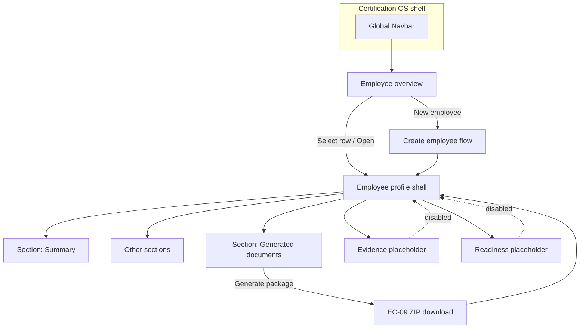

# B6.1 — Employee File IA & Navigation Design

**Gate:** B6.1 — Information architecture and navigation design only  
**Status:** **OPEN** — design document; **does not authorize implementation**  
**Date:** 2026-06-05  
**Branch:** `b3-tool2-migration`  
**Prerequisite:** B6.0 PASS FOR CONTROLLED PRODUCT DESIGN PREPARATION (`569bba3`)  
**App root:** `cert-expert-certification-os/apps/certification-os/`  
**Primary route (today):** `/employee-automation`  
**Target route (design label):** `/employee-automation` → future alias `/employee-files` (implementation gate only)

---

## 0. Control Decision

**B6.1 defines IA and navigation for the Tool 2 Employee File workspace.**

| Decision | Detail |
|----------|--------|
| What B6.1 does | Names workspace areas, overview columns, profile section structure, navigation paths, copy rules, and transitional mapping from B5.7 queue |
| What B6.1 does **not** do | Authorize code, routes implementation, persistence, evidence upload, readiness algorithms, or generator changes |
| Next gate | B6.2 Employee Profile Section Design — **design only**, after B6.1 acceptance |

---

## 1. Summary

This document defines the **information architecture (IA)** and **navigation model** for the Cert-Expert Tool 2 Employee File (*Mitarbeiterakte*). It transitions the operator mental model from the **B5.7 generator queue** toward a **profile-centric file workspace** while explicitly preserving the transitional `localStorage` queue and **EC-09 ZIP** path until later implementation gates.

The IA organizes work around **one employee file at a time**: overview → select/open → profile sections → generator output. Evidence, readiness, and SDL areas appear as **designed placeholders** (disabled or “not implemented”) — not as functional surfaces in this slice.

**Expected gate result:** **PASS FOR EMPLOYEE FILE IA DESIGN**

---

## 2. Source Baseline

### 2.1 B5.7 workspace shell

| Element | Current behavior | IA use |
|---------|------------------|--------|
| Page title | “Employee File Workspace” | Top-level workspace label — retained |
| Transitional notice | Amber banner — not release/DIN/certification | Global disclaimer zone in all target layouts |
| Queue table | “Employee files (generator queue)” | Maps to **Employee overview** (transitional data source) |
| Row selection | Click row → summary panel | Maps to **overview → profile summary** |
| Summary panel | Read-only role, dates, doc counts | Seed for **profile header** (B6.2) |
| Static badges | “Evidence: not implemented”, “Readiness: not evaluated” | Becomes **placeholder nav sections** until B7+ |
| Generate ZIP | Batch action on queue | Maps to **Generator output** area — EC-09 protected |

### 2.2 B5.8 output-quality stabilization

| Item | IA implication |
|------|----------------|
| Dates in generated docs **DD.MM.YYYY** (B5.8b) | Overview and profile display dates in **DD.MM.YYYY** for consistency with documents |
| EC-09 ZIP PASS | “Generate package” remains a **real** navigation destination — not demoted or hidden |
| Template/footer carry-forwards | Open items panel may list **design-time** carry-forwards; no fake “complete” evidence state |
| T2-BUG-10 not reproduced | No IA branch for “duplicate instruction merge” |

### 2.3 B6.0 product-design boundary

B6.1 implements **D-1 (IA)** and **D-2 (navigation)** from B6.0. It respects **§6 (generator queue relationship)**, **§7 (profile hub)**, **§12 (forbidden implementation)**, and proposes **B6.2** as the next slice per B6.0 §13.

Functional rules remain sourced from **B5.2–B5.5** — IA does not redefine Pflichtfelder, evidence catalog, or readiness layers.

---

## 3. IA Objective

**Transition:** generator queue → profile-centric Mitarbeiterakte.

| From (today) | To (target IA) |
|--------------|----------------|
| Flat queue of ZIP inputs | **Employee overview** — searchable file index |
| Row = disposable batch entry | Row = **file entry** with stable identity |
| Form above table = “add to queue” | **Create employee** → opens new profile draft |
| Summary panel beside queue | **Profile workspace** with section nav |
| Hero action = Generate all | **Secondary action** on profile / output section |
| No evidence/readiness surfaces | **Designed sections** visible but gated “not implemented” |

**Operator question the IA must answer:**

1. *Who are we managing?* → Employee overview  
2. *What is this person’s status?* → Profile header + open items  
3. *What is missing?* → Open items / carry-forwards (display-only rules)  
4. *What can I do next?* → Section actions (edit, review placeholders, generate package)

---

## 4. Main Workspace Areas

Top-level areas within the **Employee File Workspace** (Certification OS Tool 2 shell):

```
┌─────────────────────────────────────────────────────────────────┐
│  Certification OS nav  │  Dashboard │ Tool 1 │ Tool 2 │ Uploads │
├─────────────────────────────────────────────────────────────────┤
│  Workspace header + transitional notice (B5.7 lineage)          │
├──────────────┬──────────────────────────────────────────────────┤
│  AREA A      │  AREA B–G (context panel or full width)          │
│  Employee    │  Depends on selection / route depth                │
│  overview    │                                                  │
│  (list)      │  B. Employee profile (shell)                     │
│              │  C. Evidence / Nachweise (placeholder)           │
│              │  D. Roles and assignments                        │
│              │  E. Generator output                             │
│              │  F. Open items / carry-forwards                  │
│              │  G. Global company context (sidebar — transitional)│
└──────────────┴──────────────────────────────────────────────────┘
```

| ID | Area | Purpose | B6.1 depth |
|----|------|---------|------------|
| **A** | Employee overview | Find, filter, select files; create new | **Full** |
| **B** | Employee profile | Hub for one person; section container | **Structure** (detail in B6.2) |
| **C** | Evidence / Nachweise | Required Nachweise checklist (future) | **Placeholder nav only** |
| **D** | Roles and assignments | Grundrolle, Zusatzrollen, SDL/project preview | **IA slot + summary** |
| **E** | Generator output | Template selections, generate package, history | **Nav target** (wraps EC-09) |
| **F** | Open items / carry-forwards | Offene Unterlagen, blockers, design carry-forwards | **Display rules** |
| **G** | Global company context | Company name, logo, footer metadata for generation | **Transitional sidebar** — maps to existing Global Properties |

**Route depth (design intent, not implemented here):**

| Level | View | URL pattern (future) |
|-------|------|----------------------|
| L0 | Workspace home / overview | `/employee-automation` |
| L1 | Profile shell (default section: summary) | `/employee-automation/files/{fileId}` |
| L2 | Profile section | `/employee-automation/files/{fileId}/{section}` |

*B6.1 does not authorize route implementation — patterns are design targets only.*

---

## 5. Employee Overview Design

### 5.1 Purpose

The **Employee overview** replaces the mental model of “generator queue table” with an **employee file index** while still reading from the **same transitional queue data** (B5.7).

### 5.2 Visible columns (target)

| Column | Source (transitional) | Notes |
|--------|---------------------|-------|
| **Name** | `fullName` | Primary sort key; link to profile |
| **Employee ID** | `employeeIDNumber` or Guard ID if used | Optional empty |
| **Role** | Resolved `roleId` → role name | Grundrolle display |
| **Start date** | `startDate` | DD.MM.YYYY display |
| **File status** | Design label (see §5.3) | Not computed by readiness engine in B6 |
| **Open items count** | Design placeholder | Static “—” or “not evaluated” until B7 |
| **Last activity** | Design placeholder | Queue add/edit timestamp when available |
| **In generator batch** | Checkbox or indicator | Transitional: included in next ZIP batch |

**Actions (overview toolbar):**

- **New employee file** — opens create flow (maps to current EmployeeForm entry)
- **Search / filter** — by name (extends current search)
- **Open selected** — navigates to profile
- **Generate package (batch)** — **transitional** — same EC-09 batch as today; labeled “Generate ZIP for selected / all” with disclaimer

### 5.3 Allowed status labels (overview “File status” column)

Design-only labels until readiness implementation — **must not imply certification**:

| Label | Meaning (design) | When used |
|-------|------------------|-----------|
| **Draft** | Newly created; minimal data | After create, before first save completeness |
| **Open** | Active file under maintenance | Default for queue entries with required fields |
| **Prepared** | Operator marked preparation step done (future) | Manual operator action only — not auto |
| **Requires review** | Fachliche review pending (future) | Display when review flag set — not auto |
| **Inactive** | Archived / not currently deployed | Future lifecycle |
| **Not evaluated** | Readiness/evidence not implemented | **Default in transitional phase** |

### 5.4 Forbidden labels (overview and global)

**Do not use** in IA copy, column headers, tooltips, or badges unless a later gate validates against HARD_CONTROLS and EC-10:

| Forbidden | Reason |
|-----------|--------|
| Certified / zertifiziert | Implies authority Tool 2 does not have |
| Approved / freigegeben (automatic) | Release decision |
| DIN-compliant / DIN-konform | Compliance claim |
| Audit-ready / auditfähig | EC-08 / C-06 |
| Complete / vollständig (absolute) | Unless scoped: “fields complete for creation” |
| Green ampel as “OK to deploy” | C-01, C-04 |

---

## 6. Employee Profile Section Structure

The **profile** is the primary container after selecting an employee. Sections appear in **left sub-nav** (desktop) or **tab bar** (mobile).

| Order | Section ID | Label (DE / EN) | Content scope | B6.1 state |
|-------|------------|-----------------|---------------|------------|
| 1 | `summary` | Übersicht / Summary | Header, quick facts, open-item count, disclaimer | **Active design** — extends B5.7 panel |
| 2 | `master-data` | Stammdaten / Master data | Full name, birthday, IDs | Maps to EmployeeForm core |
| 3 | `employment` | Beschäftigung / Employment | Start date, status, company relation | Partial in form today |
| 4 | `roles` | Rollen / Roles & assignments | Grundrolle, Zusatzrollen, appointment overlays | Maps to role + appointment picks |
| 5 | `evidence` | Nachweise / Evidence | Checklist placeholder | **Disabled — not implemented** |
| 6 | `instructions` | Unterweisungen & Schulungen | Person-specific status lines | **Disabled — not implemented** |
| 7 | `sdl-project` | SDL & Projekt | Link preview, scoped banner | **Disabled — not implemented** |
| 8 | `output` | Dokumente & Pakete / Generated documents | Template selection, generate, history | Wraps generator — **transitional functional** |
| 9 | `open-items` | Offene Punkte / Open items | Aggregated gaps, carry-forwards | **Display-only list** |
| 10 | `notes` | Notizen / Notes | Operator notes (future) | **Disabled — not implemented** |

### 6.1 Section summaries (IA level — detail in B6.2)

**Master data:** Identity fields required for EC-01/EC-02; Bewacher-ID / Employee-ID; dates as DD.MM.YYYY.

**Employment data:** Start date, employment/file active status (design enum), employing company (from global context until per-file company exists).

**Role / Zusatzrolle:** Primary role from Hetzner catalog; overlay badges (SMA, Ersthelfer, etc.) **distinct** from “document checkbox” UI — design shows both **requirement context** and **generator doc picks** in separate sub-blocks under Roles + Output.

**Evidence status:** Section nav visible; body shows empty state: “Evidence tracking not implemented (B6 design placeholder).”

**Training / instruction status:** Same placeholder pattern — no LMS calendar.

**SDL/project assignment preview:** Read-only placeholder card: “No SDL linked” / “Not implemented.”

**Generated documents:** Houses template selection (current core/overlay doc chips), **Generate package** button, download result, future history list.

**Notes / open items:** Open items lists Pflichtfeld gaps (future), B5.8 carry-forwards (template audit items), and static reminders — **not** computed readiness.

---

## 7. Navigation Model

### 7.1 Primary flows



### 7.2 Navigation rules

| From | To | Trigger | Notes |
|------|-----|---------|-------|
| **Queue list / overview** | **Selected employee** | Row click, “Open” action | Replaces B5.7 row-select-only; adds depth |
| **Overview** | **Create flow** | “New employee file” | Maps to EmployeeForm; on save → profile |
| **Selected employee** | **Profile summary** | Default landing section | Supersedes B5.7 side summary panel layout |
| **Profile** | **Generator package** | Nav to “Generated documents” | EC-09 flow unchanged under the hood |
| **Profile** | **Evidence / readiness** | Section nav click | **Disabled state** + tooltip “Not implemented” |
| **Profile** | **Overview** | Breadcrumb / back | Preserves list selection |
| **Global navbar** | **Tool 1 / Uploads** | Existing links | No IA change to Tool 1 |

### 7.3 B5.7 → B6.1 mapping (transitional)

| B5.7 element | B6.1 IA target |
|--------------|----------------|
| EmployeeTable | Employee overview (Area A) |
| Row highlight + summary panel | Overview selection + Profile §summary |
| EmployeeForm (top) | Create flow + Profile §master-data / §employment |
| Global Properties sidebar | Area G — global company context (transitional) |
| Generate & Download ZIP | Profile §output (batch variant remains on overview) |
| EmployeeFileWorkspaceNotice | Workspace header disclaimer (all levels) |

### 7.4 Certification OS global navigation

| Nav item | Label (today) | IA note |
|----------|---------------|---------|
| Dashboard | Dashboard | Unchanged |
| Document Generator | Tool 1 | Out of scope |
| Employee Generator | **Design rename candidate:** “Employee Files” / “Mitarbeiterakte” | **Design only** — implement via copy gate |
| Upload Manager | Uploads | Template admin — unchanged |

---

## 8. Relationship to Existing Generator Queue

| Rule | Detail |
|------|--------|
| **Queue remains transitional source** | IA is designed for `employee-queue-storage` until persistence gate |
| **No localStorage replacement in B6.1** | Design assumes same data shape (`Employee` type) |
| **EC-09 ZIP flow protected** | Generate package navigates to existing server action path — no bypass |
| **Batch generate preserved** | Overview toolbar retains batch ZIP for operator parity with today |
| **Doc checkbox semantics** | Remain under **Output** and **Roles** until output-precondition gate refactors |
| **Identity key** | Transitional `id` (UUID) → design **`fileId`** alias in routes — same value |

**Deprecation narrative (copy only):**  
Overview subtitle: *“Employee files (generator queue — transitional storage).”*  
Remove only when persistence implementation gate closes.

---

## 9. Display-Only Boundaries

The following may appear in **IA diagrams, labels, and empty states** but **must not function** until explicit implementation gates:

| Surface | Display allowed | Function forbidden |
|---------|-----------------|-------------------|
| Evidence section | Nav item, empty state, mock checklist screenshot in docs | Upload, storage, status persistence |
| Readiness / ampel | Gray “not evaluated” badge, disabled ampel icon | Color computation, auto-green |
| Open items count | “—” or “not evaluated” | Real blocker engine |
| SDL/project | “Not linked” placeholder | API integration |
| Generate package | Button active (EC-09) | Must not enable “release” modal |
| Prepared status | Label in spec | Auto-assignment |

**No automatic release decision** in any navigation path — generate leads to **download**, not **freigabe**.

**No DIN/certification claim** in workspace header, overview, or profile — retain B5.7 disclaimer lineage.

---

## 10. Copy and Label Rules

### 10.1 Preferred vocabulary

| Concept | Use | Avoid |
|---------|-----|-------|
| File entry | Employee file, Mitarbeiterakte | Queue row, batch item |
| Document package | Generate package, ZIP export | Standard release, official submission |
| Missing items | Open, offene Punkte, requires review | Blocked forever, failed |
| Future features | Not implemented, planned, design placeholder | Coming soon certified |
| Operator completion | Prepared (manual, scoped) | Approved, signed off |
| Output state | Generated, exported, unchecked draft | Verified, accepted evidence |

### 10.2 Required disclaimers (inherit B5.7)

Show on overview and profile output section:

> Generated document packages are **unchecked drafts** for operational use. Export does **not** mean accepted evidence, release approval, DIN compliance, or certification readiness.

### 10.3 Date and ID display

- Dates: **DD.MM.YYYY** (aligned with B5.8b generator output)
- IDs: Show Bewacher-ID and Employee-ID when present; do not conflate in labels

---

## 11. Out-of-Scope List

Same as B6.0 §5, restated for B6.1:

- Code, components, routes implementation  
- Database / server persistence  
- Evidence upload and storage  
- Readiness algorithms and ampel computation  
- SDL release automation  
- LMS / training calendar  
- Tool 1 redesign  
- Hetzner / template / generator changes  
- `.env.local` changes  
- KPI / target establishment (Ziel-Etablierung)  
- Wireframe pixels / Figma files (optional B6.2+) — B6.1 is **IA and navigation structure only**

---

## 12. Risks and Controls

| Risk | Control |
|------|---------|
| IA implies readiness exists | Placeholder sections **disabled**; default status **“Not evaluated”** |
| Profile rename confuses operators | Keep `/employee-automation`; gradual nav label change only |
| Generate buried too deep | Retain **batch generate** on overview + profile output section |
| EC-09 regression during future build | IA mandates **same server action**; implementation gate requires ZIP smoke |
| Evidence mockups mistaken for shipped feature | Empty states must say **“not implemented”** |
| Certification language creep | §5.4 forbidden list + HARD_CONTROLS review at B6.7 |
| Queue/localStorage identity drift | Single `fileId` = current `Employee.id` until persistence gate |
| B5.8 carry-forwards hidden | **Open items** section lists template audit items as informational |

---

## 13. Proposed Next Slice

**B6.2 — Employee Profile Section Design**

| Deliverable | Content |
|-------------|---------|
| Per-section wireframe spec | Layout, fields, empty/error states for §6 sections |
| Profile header design | Ampel placeholder, breadcrumbs, primary actions |
| Create vs edit journey | Modal vs full-page — design decision |
| Transitional component map | EmployeeForm fields → section mapping |
| Copy deck | Section titles, helper text, disclaimers |

B6.2 **does not** implement navigation or routes — it details **profile interior** against this IA.

---

## 14. Gate Recommendation

### **PASS FOR EMPLOYEE FILE IA DESIGN**

| Criterion | Result |
|-----------|--------|
| IA objective aligned with B6.0 | **Yes** |
| Main workspace areas defined | **Yes** (§4) |
| Overview columns and status labels | **Yes** (§5) |
| Profile section structure | **Yes** (§6) |
| Navigation model documented | **Yes** (§7) |
| Generator queue transitional rules | **Yes** (§8) |
| Display-only boundaries | **Yes** (§9) |
| Copy rules | **Yes** (§10) |
| No implementation authorized | **Yes** |

**Acceptance of B6.1** authorizes **B6.2 Employee Profile Section Design** only.

---

## 15. Source Basis

| Document | Use |
|----------|-----|
| `B6_0_EMPLOYEE_FILE_PRODUCT_DESIGN_BOUNDARY.md` | Design envelope, D-1/D-2 |
| `B5_7_EMPLOYEE_FILE_MVP_SLICE_1_IMPLEMENTATION_REPORT.md` | Current shell baseline |
| `B5_8B_TOOL_2_MINIMAL_OUTPUT_QUALITY_FIX_REPORT.md` | Date display, EC-09 |
| `B5_2` – `B5_5` | Functional section anchors |
| `docs/03-controls/HARD_CONTROLS.md` | Forbidden claims |
| `docs/02-acceptance/ACCEPTANCE_BASELINE.md` | EC-01–EC-10 |

---

## 16. Commit

Suggested: `docs: define employee file IA and navigation design (B6.1)`
