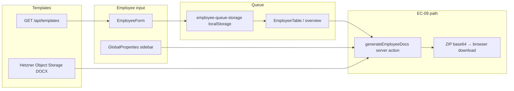

# B6.6 — Employee File Generator Integration / Output Section Design

**Gate:** B6.6 — Generator integration and output section design only  
**Status:** **OPEN** — design document; **does not authorize implementation**  
**Date:** 2026-06-05  
**Branch:** `b3-tool2-migration`  
**Prerequisite:** B6.5 PASS FOR READINESS AMPEL DISPLAY BOUNDARY DESIGN (`477dd22`)  
**App root:** `cert-expert-certification-os/apps/certification-os/`  
**Profile section ID:** `output` — Dokumente & Pakete / Generated documents (B6.2 §11)

---

## 0. Control Decision

**B6.6 defines how the existing Tool 2 generator (EC-09) integrates into the future Employee Profile output section.**

| Decision | Detail |
|----------|--------|
| What B6.6 does | Output section model, status wording, batch vs profile generation design, template categories, carry-forwards, EC-09 protection rules |
| What B6.6 does **not** do | Code, UI build, generator refactor, template/Hetzner changes, persistence, evidence/readiness engines |
| Next gate | B6.7 Employee File Design Closure Gate / Implementation Readiness Review — **design consolidation only** |

---

## 1. Summary

The Tool 2 generator produces **real DOCX/ZIP packages** from Hetzner templates (EC-09 PASS; dates **DD.MM.YYYY** per B5.8b). B6.6 designs how that capability appears **inside** the Employee Profile as **prepared outputs** — subordinate to the file, never mistaken for accepted evidence, release, or audit/certification readiness.

The **current runtime** remains: employee form → `localStorage` queue → template chip selection → batch **Generate & Download ZIP** on `/employee-automation`. B6.6 specifies the **target output section layout** and integration rules **without** refactoring `generateEmployeeDocs` or moving generation logic.

**Expected gate result:** **PASS FOR GENERATOR OUTPUT SECTION DESIGN**

---

## 2. Source Baseline

| Source | Relevance to B6.6 |
|--------|-------------------|
| **B5.7 workspace shell** | Generate button, disclaimer, queue framing; summary doc counts |
| **B5.8a output-quality verification** | Confirmed en-US date issue (fixed in B5.8b); template/footer gaps; {K}/{F}/{SK} false positives |
| **B5.8b DD.MM.YYYY fix** | Generator date output normalized — display in output section uses DD.MM.YYYY |
| **B6.0 product-design boundary** | Generator subordinate (§11); EC-09 protected; no fake ZIPs |
| **B6.1 IA/navigation** | Output section nav; overview batch generate retained |
| **B6.2 profile section design** | §11 layout blocks A–F; EC-09 protection |
| **B6.3 evidence section design** | E8 generated documents; Prepared / Requires review; no auto-accept |
| **B6.4 assignment design** | Role/overlay doc picks separate from Grundrolle semantics |
| **B6.5 readiness/Ampel boundary** | ZIP success must not change ampel; grey Not evaluated only in B6 |

Functional output rules: **B5.5** (output ≠ evidence, EC-09 protection).

---

## 3. Generator Integration Objective

| Objective | Detail |
|-----------|--------|
| **Stability** | Keep EC-09-protected path: `generateEmployeeDocs` → Hetzner templates → ZIP — unchanged in B6 |
| **Positioning** | Generated documents live in profile **Output** section as **prepared outputs**, not file completion |
| **Boundary** | Export supports preparation; does **not** create accepted Nachweise, release, or compliance claims |
| **Transitional parity** | Operators retain today’s working flow until implementation gate migrates UI |
| **Future enrichment** | Output history, scoped generate, preconditions messaging — design only |

**Success (design):** Operator opens profile → sees what will be included → generates package → downloads ZIP → sees **Generated — requires review** — file and ampel stay **Not evaluated**.

---

## 4. Current Generator Baseline

Describes **runtime today** (B5.7 + B5.8b) — reference for integration design, not modified in B6.6.

### 4.1 Flow diagram



### 4.2 Step reference

| Step | Component | Detail |
|------|-----------|--------|
| 1 | **Employee input** | `EmployeeForm`: name, birthday, start date, role, IDs, role/appointment doc chip selections |
| 2 | **Queue / localStorage** | `employee-queue-storage` persists array of `Employee` records |
| 3 | **Template selection** | `selectedRoleDocIds`, `selectedAppointmentDocIds` on each employee |
| 4 | **Role templates** | Hetzner `roles/{roleId}/*.docx` — e.g. Jahresweiterbildung, Datenschutz, Dienstausweis |
| 5 | **Appointment templates** | Hetzner `appointments/{id}/*.docx` — e.g. Unterweisungsnachweise |
| 6 | **Template loading** | `/api/templates` lists catalog; generator uses `listTemplateFiles` + `fetchTemplateBufferByKey` |
| 7 | **Generate ZIP** | `generateEmployeeDocs(employees, globalProps, roles, appointments)` → JSZip folder per employee |
| 8 | **Download** | Client decodes base64 → `employee-documents-{timestamp}.zip` |
| 9 | **EC-09 protection** | Single server action path; no client-side template fill; C-09 regression on any generator gate |

### 4.3 Batch behavior today

- **Generate & Download ZIP** processes **all employees in queue** (or design retains overview batch — B6.1).
- Global company logo merged at generate time from sidebar (`logoFile` session carry-forward — B4.2).

---

## 5. Output Section Model

Future profile section **`output`** — **Dokumente & Pakete / Generated documents**.

### 5.1 Section layout (design target)

```
┌─ Generated documents ─────────────────────────────────────────────┐
│ [Disclaimer: unchecked draft — not accepted evidence]           │
├─ A. Company context (read-only) ────────────────────────────────┤
│  Company · Address · Email · Footer metadata (session/global)   │
├─ B. Selected role templates ────────────────────────────────────┤
│  Grundrolle: [name]   Chips: core DOCX selected / not selected  │
├─ C. Selected appointment / training templates ──────────────────┤
│  Overlays: [names]   Chips: overlay DOCX selected / not sel.  │
├─ D. Package / ZIP output ───────────────────────────────────────┤
│  [ Generate package (ZIP) ]   Last: Not generated               │
│  Generated-on: — (DD.MM.YYYY when exists)                       │
│  Status: Not generated | Generated — requires review            │
├─ E. Generated employee documents (history / last run) ─────────┤
│  List: filename · category · Prepared · Requires review         │
├─ F. Requires-review note (persistent banner) ───────────────────┤
│  "Review generated documents before treating as Nachweise."     │
└─────────────────────────────────────────────────────────────────┘
```

### 5.2 Output areas defined

| Area ID | Name | Content | Data source (transitional) |
|---------|------|---------|----------------------------|
| **O1** | Generated employee documents | Per-DOCX lines from last export (design) | Future history store; today: implicit in ZIP only |
| **O2** | Selected role templates | Core document chips + role name | `roleId`, `selectedRoleDocIds`, `/api/templates` |
| **O3** | Selected appointment/training templates | Overlay chips + appointment names | `appointmentIds`, `selectedAppointmentDocIds` |
| **O4** | Package / ZIP output | Primary generate action + last package metadata | `generateEmployeeDocs` result |
| **O5** | Generated-on date | Timestamp of last successful generate | Future history; display **DD.MM.YYYY** + time optional |
| **O6** | Requires-review note | Static + post-generate reminder | Copy only — B6.3 / B5.5 |

### 5.3 Cross-links (design)

| From output section | Link to |
|--------------------|---------|
| Role template chips | **Roles** section (B6.4) — same selections, different framing |
| Prepared outputs | **Evidence** E8 rows (disabled) — “See generated documents” |
| Open preconditions (future) | **Open items** — informational only in B6 |
| Company context | **GlobalProperties** sidebar (transitional) |

---

## 6. Output Status Wording

### 6.1 Allowed labels

| Label | Use |
|-------|-----|
| **Prepared** | Package or DOCX produced; draft state |
| **Generated** | Successful EC-09 run (synonym for Prepared in package row) |
| **Requires review** | Default post-generate status; fachliche check pending |
| **Not generated** | No successful export recorded for scope |
| **Not selected** | Template chip not in `selectedRoleDocIds` / `selectedAppointmentDocIds` |
| **Open** | Selection incomplete or operator action pending (informational) |
| **Not implemented** | Output history, preconditions engine, profile-only generate UI |

### 6.2 Forbidden labels

| Forbidden | Reason |
|-----------|--------|
| **Approved** | Sign-off |
| **Accepted evidence** | B5.3 — requires review workflow |
| **Certified** | Certification claim |
| **DIN-compliant** | Compliance claim |
| **Audit-ready** | C-06 |
| **Released** | SDL/release |
| **Complete** (package) | Implies file/evidence complete |
| **Verified** | Auto-verification |

### 6.3 Post-generate copy (required)

> Documents generated — **unchecked draft**. Download does not create accepted Nachweise or release approval.

(Inherits B5.7 workspace disclaimer.)

---

## 7. Relationship to Evidence Section

| Rule | Detail |
|------|--------|
| **Future path** | Generated DOCX may **later** be linked to evidence item as `generated unchecked` → human review → accepted (B5.3) |
| **B6 state** | All generated outputs remain **prepared only** — evidence section **Not implemented** |
| **No auto-accept** | Successful ZIP does **not** set evidence row to Provided/Accepted |
| **E8 category** | B6.3 generated-documents category references output section — one-way informational link |
| **Datenschutz / Unterweisung** | Generated template fill ≠ signed Nachweis until review gate (future) |
| **Upload still required** | External proofs (§34a scan, etc.) never satisfied by generate alone |

---

## 8. Relationship to Readiness / Ampel

| Rule | Detail |
|------|--------|
| **ZIP success** | Must **not** change profile ampel from grey **Not evaluated** (B6.5 D-9) |
| **Not complete** | Generated output does **not** mean employee file complete |
| **Not released** | No release-preparation complete indicator on generate |
| **Not audit-ready** | No audit-ready banner or green ampel |
| **B6 live UI** | Only static badges: “Readiness: not evaluated” |
| **Future** | Optional yellow “generated unchecked items exist” — **separate B7 gate**, not B6.6 |

---

## 9. Batch vs Individual Generation

| Mode | Design placement | B6.6 scope |
|------|------------------|------------|
| **Batch generation** | **Employee overview** / queue toolbar — **retain** current “Generate for all in queue” | Document as primary transitional UX |
| **Profile-level generate** | **Output section** — generate **this file’s** queue entry only | **Design-only** — no per-profile refactor authorized |
| **Selection scope** | Batch = all `employees[]` passed to action today; profile = single employee array `[file]` (future API shape — design intent only) |
| **No refactor** | B6.6 does **not** authorize splitting or rewriting `handleGenerate` / server action signature |

**Rule:** Implementation gate must prove EC-09 for **both** batch (regression) and profile-scoped (if added) paths.

---

## 10. Template Category Model

| Category | Hetzner path pattern | Output section display | Generator role |
|----------|---------------------|------------------------|----------------|
| **Role templates** | `roles/{roleId}/*.docx` | Block B — core documents | Placeholder fill via `templateData` |
| **Appointment / training templates** | `appointments/{id}/*.docx` | Block C — overlay documents | Same loop, appointment folders in ZIP |
| **Generated package outputs** | ZIP root `{fullName}/…` | Block D — package row | JSZip aggregate — EC-09 |
| **Template audit carry-forwards** | Source templates unchanged | Open items + footnote in section F | Design reference only |

### 10.1 Role template examples (current bucket)

| Template file (example) | Design label in UI |
|-------------------------|-------------------|
| `01_Jahresweiterbildung_DIN_77200-1_24UE.docx` | Role — training certificate |
| `Datenschutz und Vertraulichkeit.docx` | Role — legal declaration |
| `Ausgabe Dienstausweis.docx` | Role — Dienstausweis |

### 10.2 Appointment template examples

| Template file (example) | Design label |
|-------------------------|--------------|
| `Unterweisungsnachweis_Allgm. Pflichtunterweisung.docx` | Overlay — instruction record |
| `Unterweisungsnachweis_Arbeitsschutz_DGUV.docx` | Overlay — Arbeitsschutz |

### 10.3 Selection vs requirement

- **Chip selected** → included in next ZIP — status **Prepared** only **after** generate.
- **Chip not selected** → **Not selected** — does not imply requirement waived (requirement = evidence/role rules, future).

---

## 11. Output-Quality Carry-Forwards

Document in output section helper text / open items — **do not fix in B6.6**.

| Carry-forward | Source | Output section treatment |
|---------------|--------|--------------------------|
| **Footer metadata** (`DocVersion`, `DocDate`, `CreatedBy`, `ApprovedBy`) not in rendered DOCX when templates omit tokens | B5.8a/b, T2-BUG-09b | Info note under company context: “Footer fields supplied in sidebar may not appear in all documents.” |
| **`{EndDate}` not mapped** | B5.8b template audit | Note in open items; training URKUNDE may lack end date in output |
| **Template standardization** | Future template gate | Not B6.6 — link to template audit backlog |
| **T2-BUG-10 duplicate content** | B5.8a not reproduced | Watch item in open items — no design branch for merge |
| **Training URKUNDE without company block** | B5.8a | Informational — template design, not generator regression |
| **`logoFile` session persistence** | B4.2 | Company context note: logo may be missing after reload |

---

## 12. EC-09 Regression Protection Rules

| # | Rule |
|---|------|
| R-1 | **Existing ZIP generation must remain usable** after any B7 UI work — smoke per B5.7/B5.8 method |
| R-2 | **`generateEmployeeDocs` unchanged** unless explicit generator gate (not B6.6) |
| R-3 | **`/api/templates` and Hetzner fetch unchanged** in integration design |
| R-4 | **No client-only DOCX fill** — server action only |
| R-5 | **No template or placeholder map changes** as part of output section UI gate |
| R-6 | **Real Hetzner templates only** in regression — no fake ZIPs (B5.5) |
| R-7 | **DD.MM.YYYY dates preserved** — output section display aligns; no revert to en-US in generator |
| R-8 | **Broad refactor blocked** — moving generator module, splitting action, or new zip library requires C-09 gate |
| R-9 | **Tool 1** `send-model-entries` out of scope — no shared refactor |

**Regression trigger for B7 output UI:** Any profile output card that calls generate must use **same** server action import path as today.

---

## 13. MVP State and Future State

### 13.1 Current / B6 (design only)

| Element | State |
|---------|--------|
| Output section UI in profile | **Not built** — design spec only |
| Generate location | **Overview / B5.7 page** — form + batch button |
| Output history | **Not implemented** |
| Profile-level generate button | **Design intent** — not authorized to build |
| Status chips on output | **Not implemented** — copy rules defined |
| Evidence link | **Disabled** placeholder |

### 13.2 Future / B7+ (implementation gates)

| Capability | Gate |
|------------|------|
| Profile output section (blocks A–F) | B7 UI slice + EC-09 smoke |
| Output history store | Persistence + B7 |
| Profile-scoped generate | B7 — single-employee call, same action |
| Preconditions disable generate | B7 policy — optional, not default in B6.6 |
| Package enrichments (summary PDF, open-items snapshot) | B5.5 future package — separate gate |
| Link generate → evidence `generated unchecked` | Evidence implementation gate |

---

## 14. Risks and Controls

| Risk | Control |
|------|---------|
| Output section implies evidence complete | Requires-review banner + forbidden labels §6.2 |
| Profile generate breaks batch EC-09 | R-1, R-9 — batch regression mandatory |
| Green ampel on download | B6.5 D-9 |
| Template chips confused with evidence checklist | Separate blocks B/C vs evidence nav (B6.3) |
| Footer metadata confusion | Carry-forward note §11 |
| Premature profile-only refactor | B6.6 design-only; B7 gate for code |
| DIN implied by Jahresweiterbildung template names | No DIN-compliant label on output rows |
| Duplicate Unterweisung content | T2-BUG-10 watch — not reproduced |

---

## 15. Out-of-Scope List

- Code, components, routes  
- `generateEmployeeDocs` / generator refactor  
- Template content, Hetzner, `/api/templates` changes  
- Tool 1, `.env.local`  
- Persistence, evidence upload, readiness algorithms, ampel calculation  
- Release automation, DIN/audit/certification claims  
- LMS, KPI / Ziel-Etablierung  
- Output history implementation  
- Template standardization / `{EndDate}` mapping fixes  

---

## 16. Proposed Next Slice

**B6.7 — Employee File Design Closure Gate / Implementation Readiness Review**

| Deliverable | Content |
|-------------|---------|
| Consolidated B6 design pack | B6.0–B6.6 traceability matrix |
| B5 → B6 alignment check | Functional vs product design gaps |
| Implementation slice proposal | Ordered B7 slices (UI shell, persistence, evidence, …) |
| EC-09 / HARD_CONTROLS checklist | Pre-implementation gates |
| Gate recommendation | PASS FOR CONTROLLED IMPLEMENTATION PREPARATION or carry-forwards |

---

## 17. Gate Recommendation

### **PASS FOR GENERATOR OUTPUT SECTION DESIGN**

| Criterion | Result |
|-----------|--------|
| Generator integration objective | **Yes** (§3) |
| Current baseline documented | **Yes** (§4) |
| Output section model | **Yes** (§5) |
| Status wording | **Yes** (§6) |
| Evidence / readiness relationships | **Yes** (§7–§8) |
| Batch vs profile design | **Yes** (§9) |
| Template category model | **Yes** (§10) |
| Quality carry-forwards | **Yes** (§11) |
| EC-09 protection rules | **Yes** (§12) |
| MVP vs future | **Yes** (§13) |
| No implementation authorized | **Yes** |

**Acceptance of B6.6** authorizes **B6.7 Employee File Design Closure Gate** only.

---

## 18. Source Basis

| Document | Use |
|----------|-----|
| `B5_5_STANDARD_EMPLOYEE_FILE_OUTPUT_BOUNDARY.md` | Output principles, EC-09 |
| `B5_7` / `B5_8A` / `B5_8B` | Runtime + quality baseline |
| `B6_0` – `B6_5` | Design envelope, sections, evidence, readiness |
| `modules/…/generate-employee-docs.ts` | Reference — not modified |
| `docs/03-controls/HARD_CONTROLS.md` | C-09 |

---

## 19. Commit

Suggested: `docs: define employee file generator output section design (B6.6)`
