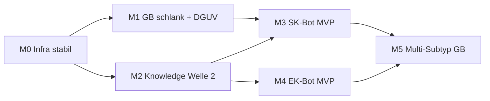

# Meilensteinplan — parallele Agenten-Arbeit

**Rolle:** Projektsteuerung Cert-Expert (Bot-Spur vs. CEKS-Spur)  
**Stand:** 2026-06-02  
**Branch:** `cursor/din-77200-1-anforderungsprofile`

---

## Ausgangslage (kurz)

| Bereich | Status |
|---------|--------|
| Blueprint-Pfade + Policy | ✅ `CONTEXT_ASSEMBLY_POLICY`, Loader, Smoke GB |
| SDL P0 (4 Subtypen) | ✅ reviewed |
| SK/EK Produktgerüst | ✅ `6_products/sicherheitskonzept`, `einsatzkonzept` |
| DGUV Extrakte | ✅ **reviewed** (215-310, 211-005) — **nicht** im GB-Blueprint |
| GB-Promptgröße | ⚠️ ~146k Zeichen — **Blocker** vor Modul-Erweiterung |
| SK/EK/ODA-Bots | ❌ keine Blueprints, kein Loader-Lauf |
| CEKS / DIN 77200 | ✅ eigene Spur (`1_standards/`) — **nicht** mit Bot-Agenten mischen |

---

## Leitplanken für alle Agenten

1. **Zwei Spuren:** Bot-Arbeit = `3_sdls`, `4_sources`, `6_products`, `7_blueprint`, `8_guides`, `10_rules`, `11_examples`, `shared/`, `bots/`. CEKS = `1_standards/` nur auf expliziten Auftrag.
2. **Kein Vault-Scan** in Runtime-Bots; Entwicklung liest gezielt `BOT_CONTEXT_MAP.md` + Blueprint-JSON.
3. **Gate vor neuem Bot:** Policy Kap. „Gate“ — Smoke grün, `6_products` vollständig, SDL reviewed.
4. **Keine PDFs in Git** ohne Freigabe; Extrakte in `4_sources/`, Inventar in `inputs/raw_standards/*/README.md`.
5. **Commits:** ein Stream = ein thematischer Commit; keine Misch-Commits über Streams.

---

## Meilensteine (Übersicht)



| ID | Name | Ziel | Dauer (Richtwert) |
|----|------|------|-------------------|
| **M0** | Infra & Messbarkeit | Prompt-Budget, Smoke, Docs sync | 0,5–1 Tag |
| **M1** | GB Kampfsport „production-ready“ | Lean-Blueprint + 1–2 DGUV-Module, Qwen-Test | 1–2 Tage |
| **M2** | Knowledge Welle 2 | P1-Subtypen + Praxisquellen + ODA-Gerüst | 2–4 Tage parallel |
| **M3** | SK-Bot MVP | Blueprint + Template + Smoke | 2–3 Tage nach M1 |
| **M4** | EK-Bot MVP | wie M3, kann parallel zu M3 starten | 2–3 Tage nach M1 |
| **M5** | GB Multi-Subtyp | fussball/konzert Blueprints, Kap.-5-Variante | nach M2+M1 |

---

## M0 — Infra & Messbarkeit (sequenziell, 1 Agent)

**Owner:** Agent **Infra** (`shared/`, `tests/`, `docs/`)

| Task | Deliverable | Done wenn |
|------|-------------|-----------|
| M0.1 | Zeichen-/Token-Zähler in Smoke oder `context_builder` | Report pro Blueprint (stdout/JSON) |
| M0.2 | `gb_event_kampfsport_lean.json` als **Referenz-Allowlist** dokumentieren | `BOT_CONTEXT_MAP.md` + Zielgröße (z. B. &lt; 80k Zeichen) |
| M0.3 | `AUSBAUPLAN.md` Phase C auf **reviewed** setzen | kein „PDF offen“ für DGUV P0 |
| M0.4 | `.gitignore` / Inputs-Doku | PDFs lokal, README inventarisiert |

**Exit M0:** Smoke GB + Lean laufen; Größenreport existiert.

---

## M1 — GB schlank + DGUV (1 Agent, nach M0)

**Owner:** Agent **Blueprint**

| Task | Deliverable | Done wenn |
|------|-------------|-----------|
| M1.1 | Prompt trimmen: `risk_patterns/*` priorisieren oder in Lean auslagern | `gb_event_kampfsport` &lt; Budget ODER Lean = Default |
| M1.2 | `4_sources/dguv/crowd_veranstaltung.md` in Lean-Blueprint | Loader OK, Smoke grün |
| M1.3 | Optional: `veranstaltungen_organisation.md` nur SK-Vorbereitung — **nicht** GB bis Budget passt | dokumentiert in BOT_CONTEXT_MAP |
| M1.4 | 1× End-to-End Qwen-Lauf (manuell oder Script) mit Test-Input | DOCX + keine Halluzinations-Flags in Review |

**Exit M1:** Kampfsport-GB mit DGUV-Praxis + akzeptable Promptgröße.

**Blocker:** M1.2 nicht starten vor M0.2 (sonst wieder Context-Overflow).

---

## M2 — Knowledge Welle 2 (4 Agenten parallel)

Keine Blueprint-Änderungen in diesem Stream (außer explizit in M1).

### Stream K1 — SDL P1 Subtypen

**Owner:** Agent **SDL**  
**Input:** `subtypes/kampfsport.md`, `SUBTYPE_GAP_MATRIX.md`, `VERANSTALTUNGSTYPEN_KATALOG.md`

| Task | Output | Review |
|------|--------|--------|
| K1.1 | `festival.md` | draft → reviewed |
| K1.2 | `demonstration.md` | draft → reviewed |
| K1.3 | `stadtfest.md` | draft → reviewed |
| K1.4 | `messe.md` | draft → reviewed |

**Exit:** Gap-Matrix P1-Zeilen = reviewed; Katalog verlinkt.

---

### Stream K2 — Praxisquellen (Extrakte)

**Owner:** Agent **Sources**  
**Schema:** `knowledge/4_sources/EXTRACTION_SCHEMA.md`

| Task | Quelle | Ziel |
|------|--------|------|
| K2.1 | Staging / Behörde | `4_sources/behoerden/grossevent_abstimmung.md` |
| K2.2 | Praxis / intern | `4_sources/praxisleitfaeden/sk_veranstaltung_geruest.md` |
| K2.3 | `inputs/practical_sources/*VA*.docx` | `va_erstellung_hinweise.md` (ODA-Vorbereitung) |
| K2.4 | DGUV (falls PDF) | `einsatz_belastung.md` — nur wenn Quelle vorliegt |

**Exit:** Registry in `4_sources/*/README.md` aktualisiert; Status mindestens `reviewed`.

---

### Stream K3 — Produkt ODA

**Owner:** Agent **Products**

| Task | Output |
|------|--------|
| K3.1 | `6_products/oda/purpose.md` + `content_blocks.md` |
| K3.2 | `6_products/README.md` Kette SK→GB→EK→ODA |

**Exit:** Phase B4 aus AUSBAUPLAN erledigt.

---

### Stream K4 — Guides / Beispiele (optional, entkoppelt)

**Owner:** Agent **Guides**

| Task | Output |
|------|--------|
| K4.1 | 1 GB-Beispiel `fussball` oder `konzert` in `11_examples/` |
| K4.2 | Risk-Pattern-Duplikate bereinigen (Crowd: `8_guides` vs `4_sources`) — Verweis statt Doppeltext |

**Exit:** Kein inhaltlicher Widerspruch zwischen `crowd_dynamics.md` und DGUV-Extrakt (Cross-Links).

---

## M3 — SK-Bot MVP (1–2 Agenten, nach M1 + K3)

**Owner:** Agent **Bot-SK** (`bots/`, `7_blueprint/`, `templates/`)

| Task | Deliverable |
|------|-------------|
| M3.1 | `sk_event_kampfsport.json` — Allowlist: SDL, `6_products/sicherheitskonzept`, Regeln SK, 1–2 `4_sources`, keine CEKS |
| M3.2 | `prompts/products/sk_*`, Smoke `tests/smoke_sk_event_kampfsport.py` |
| M3.3 | DOCX-Template-Skelett |
| M3.4 | `BOT_CONTEXT_MAP.md` Eintrag |

**Exit:** `python -m shared.blueprint_loader sk_event_kampfsport` + Smoke grün.

**Abhängigkeit:** `6_products/sicherheitskonzept` ✅; DGUV-Org-Extrakt empfohlen.

---

## M4 — EK-Bot MVP (parallel zu M3 möglich)

**Owner:** Agent **Bot-EK**

Gleiche Struktur wie M3 mit `einsatzkonzept`, `ec_event_kampfsport.json`, EK-Regeln, `unterweisung_veranstaltung.md` nur wenn ODA/EK-Briefing im Scope.

**Exit:** Loader + Smoke für EK.

---

## M5 — GB Multi-Subtyp & Kap. 5 (nach M1 + K1)

| Task | Owner |
|------|--------|
| M5.1 | `gb_event_fussball.json`, `gb_event_konzert.json` (Lean-Klon + Subtyp tauschen) |
| M5.2 | Variante `*_kap5.json` mit `veranstaltung_besondere_sicherheitsrelevanz/base.md` |
| M5.3 | Smoke je Blueprint |

**Nicht parallel:** Kap.-5-Blueprints ohne getestetes Lean-Basis-Blueprint.

---

## Agenten-Zuordnung (Copy-Paste Prompts)

### Agent Infra (M0)
```
Lies docs/CONTEXT_ASSEMBLY_POLICY.md und knowledge/BOT_CONTEXT_MAP.md.
Ziel M0: Prompt-Größenreport für gb_event_kampfsport + lean; Smoke erweitern; AUSBAUPLAN Phase C DGUV auf reviewed.
Keine Änderungen an 1_standards/. Branch: cursor/din-77200-1-anforderungsprofile.
```

### Agent Blueprint (M1)
```
Nach M0: GB-Prompt unter Budget bringen; crowd_veranstaltung.md in gb_event_kampfsport_lean (oder Default) aufnehmen; Smoke + BOT_CONTEXT_MAP; ein Testlauf dokumentieren.
Nicht: neue Subtypen, keine CEKS.
```

### Agent SDL (K1)
```
Erstelle/reviewe P1-Subtypen festival, demonstration, stadtfest, messe nach kampfsport-Vorlage; aktualisiere SUBTYPE_GAP_MATRIX + Katalog. Kein 7_blueprint.
```

### Agent Sources (K2)
```
Extrahiere nach EXTRACTION_SCHEMA: behoerden/grossevent, praxis sk_veranstaltung, optional VA-DOCX. Registry READMEs. Keine PDFs committen.
```

### Agent Products (K3)
```
ODA purpose + content_blocks; README Kette. Kein Bot-Code.
```

### Agent Bot-SK / Bot-EK (M3/M4)
```
Nur nach Freigabe M1: neues Blueprint JSON + Smoke + prompts skeleton. Gate in CONTEXT_ASSEMBLY_POLICY prüfen.
```

### Agent CEKS (getrennt — nur auf Anfrage)
```
Arbeit ausschließlich knowledge/1_standards/ und Governance. Keine 7_blueprint, keine bots/.
```

---

## Parallelisierungs-Matrix

| Parallel OK | Nicht parallel (Merge-Konflikt) |
|-------------|----------------------------------|
| K1 + K2 + K3 + K4 | M1 + M1 (zwei Blueprint-Editoren) |
| K1 + K3 | M3 + M1 am selben `gb_event_kampfsport.json` |
| M3 + M4 (verschiedene Blueprint-IDs) | K4 Crowd-Text + M1 DGUV ohne Abstimmung |
| M0 dann M1 | SK-Bot vor M0/M1 Budget |

**Empfohlene Woche 1:**
- Tag 1: **Infra (M0)** → **Blueprint (M1)**
- Tag 1–3 parallel: **SDL (K1)** + **Sources (K2)** + **Products (K3)**
- Tag 4–5: **Bot-SK (M3)** + **Bot-EK (M4)** parallel

---

## Definition of Done (Projekt)

- [x] GB Kampfsport Lean: &lt; 80k Budget, DGUV-Crowd geladen (`gb_event_kampfsport_lean`)
- [ ] GB Kampfsport: 1 erfolgreicher Qwen-Lauf (manuell)
- [x] 4× P1-Subtypen reviewed
- [x] SK: Blueprint + Smoke + Map-Eintrag (`sk_event_kampfsport`)
- [ ] EK: Blueprint + Smoke + Map-Eintrag
- [x] ODA-Gerüst in `6_products/oda/`
- [x] Praxis-Extrakte (`behoerden/grossevent`, `praxis` SK + VA)
- [x] M0: `scripts/context_size_report.py`, `practice_sources` in Loader
- [ ] CEKS unangetastet außer expliziter Task

---

## Bewusst zurückgestellt (Phase 2)

- Portal / Flow Upstream (`projects/{id}/upstream/`)
- Token-Hard-Cap in Qwen-Pipeline (nach Messung M0)
- `festival`/`fussball` GB-Blueprints bis M5
- Qualifikationsfreigabe CEKS erweitern
- PDFs in Git LFS
- Obsidian-Aufräumen (`4_document_types`, leere Ordner)

---

## Nächster Sofort-Schritt (heute)

1. **Agent Infra** starten (M0) — 2–4 h  
2. Drei parallele Chats/Tasks: **SDL K1**, **Sources K2**, **Products K3**  
3. **Agent Blueprint (M1)** erst nach M0-Report

*Aktualisieren bei Meilenstein-Abschluss: Datum + Checkbox in diesem Dokument.*
