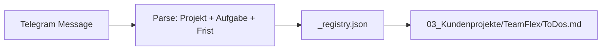

# MOBILE_INPUT_TODO_ARCHITECTURE — Telegram / Sprache → ToDos.md

**Stand:** 2026-06-02  
**Status:** Vorbereitung — **keine Implementierung** in diesem Audit  
**Ziel:** Später Sprachnachricht → strukturierter Eintrag in `Cert-Expert HQ/03_Kundenprojekte/{Kunde}/ToDos.md`

---

## 1. Use Case (Zielvision)

**Input (Sprache/Text):**

> „TeamFlex: Wachbuchauszug fehlt noch. Kunde soll das bis morgen schicken.“

**Output (Datei):**

`Cert-Expert HQ/03_Kundenprojekte/TeamFlex/ToDos.md` — neuer Eintrag mit einheitlichem Schema.

---

## 2. Voraussetzungen (Struktur)

### 2.1 HQ-Ordner muss existieren

```
Cert-Expert HQ/03_Kundenprojekte/TeamFlex/ToDos.md
```

Wenn `TeamFlex` unbekannt → **Reject** oder Eintrag in `01_Master_Dump/` zur Klärung (Policy-Entscheid).

### 2.2 Maschinenlesbares To-do-Format

Jeder To-do-Eintrag ist ein **Markdown-Block** mit festen Feldern (Reihenfolge stabil für Parser).

---

## 3. Kanonisches To-do-Schema (Pflicht)

```markdown
## TODO-20260602-143022-a1b2

- **Aufgabe:** Wachbuchauszug vom Kunden einfordern
- **Projekt:** TeamFlex
- **Kategorie:** Nachweis / Dokumentation
- **Verantwortlich:** (unassigned)
- **Frist:** 2026-06-03
- **Status:** open
- **Priorität:** normal
- **Quelle:** telegram/voice
- **Nächster Schritt:** Kunde per E-Mail ansprechen; Frist morgen kommunizieren
- **Erstellt:** 2026-06-02T14:30:22+02:00
- **Rohinput:** "TeamFlex: Wachbuchauszug fehlt noch. Kunde soll das bis morgen schicken."
```

### 3.1 Feldregeln

| Feld | Typ | Pflicht | Hinweise |
|------|-----|---------|----------|
| `Aufgabe` | string | ja | Imperativ, 1 Satz |
| `Projekt` | enum/slug | ja | muss Ordner unter `03_Kundenprojekte/` matchen |
| `Kategorie` | enum | ja | siehe Taxonomie §4 |
| `Verantwortlich` | string | nein | `(unassigned)` wenn leer |
| `Frist` | ISO date | nein | aus „morgen“, „bis Freitag“ parsen → OP wenn unklar |
| `Status` | enum | ja | `open`, `in_progress`, `done`, `cancelled` |
| `Priorität` | enum | ja | `low`, `normal`, `high`, `urgent` |
| `Quelle` | string | ja | `telegram/text`, `telegram/voice`, `manual`, `email` |
| `Nächster Schritt` | string | empfohlen | konkrete Handlung |
| `Erstellt` | ISO datetime | ja | System |
| `Rohinput` | string | ja | Audit-Trail |

### 3.2 ID-Konvention

`TODO-{YYYYMMDD}-{HHMMSS}-{4char}` — eindeutig, sortierbar, grep-freundlich.

---

## 4. Kategorie-Taxonomie (Start)

| Kategorie | Beispiel-Trigger |
|-----------|------------------|
| `Nachweis / Dokumentation` | Wachbuch, Nachweis, Unterlage |
| `Kundenkommunikation` | Kunde soll, Rückmeldung |
| `Vertrieb / Angebot` | Angebot, LV, Preis |
| `Software` | Bot, Portal, DFSS |
| `Forderung / Finance` | Rechnung, Mahnung |
| `Audit / Zertifizierung` | Audit, DIN, Nachweispaket |
| `Einsatz / Operativ` | Einsatz, Veranstaltung, SK, EK |
| `Intern / Allgemein` | sonstiges |

Parser: Keyword-Mapping + LLM-Fallback (später) — **jetzt** nur Schema festlegen.

---

## 5. Projekt-Erkennung aus Freitext

### 5.1 Regelbasiert (MVP später)

1. Erkenne Präfix `"{Projekt}:"` am Satzanfang (wie im Beispiel).
2. Alias-Tabelle:

| Gesprochen / Text | Ordner-Slug |
|-------------------|-------------|
| TeamFlex | `TeamFlex` |
| Wolf Street | `Wolf_Street` |
| SecuGuard | `SecuGuard` |
| … | … |

3. Wenn mehrdeutig → Eintrag in `01_Master_Dump/` + OP-Feld `Projekt: (klären)`.

### 5.2 Registry-Datei (empfohlen)

`Cert-Expert HQ/03_Kundenprojekte/_registry.json`:

```json
{
  "projects": [
    { "slug": "TeamFlex", "aliases": ["teamflex", "team flex"], "active": true }
  ]
}
```

---

## 6. Zielpfad-Auflösung



**Append-only:** neue Einträge ans Dateiende (oder unter `## Offen`).

**Datei-Struktur ToDos.md (empfohlen):**

```markdown
# ToDos — TeamFlex

## Offen
<!-- neue Einträge hier -->

## In Bearbeitung

## Erledigt
```

Status-Wechsel später = Verschieben zwischen Überschriften (manuell oder Bot).

---

## 7. Komponenten (spätere Implementierung — nur Architektur)

| Komponente | Rolle | Repo |
|----------|-------|------|
| Telegram Bot / Webhook | Empfang | extern oder `hq/ingest/` |
| Ingest Service | Parse + Validate | `hq/ingest/todo_ingest.py` |
| LLM (optional) | Frist/Kategorie extrahieren | `shared/api_client` wiederverwendbar |
| File Writer | Atomic append | schreibt nur unter HQ |
| Audit Log | `02_Operations_Board/ingest_log.jsonl` | HQ |

**Sicherheit:**

- Schreibzugriff nur auf `Cert-Expert HQ/`
- Kein Schreiben in `knowledge/`
- Idempotenz-Key pro Telegram `message_id` (Duplikate vermeiden)

---

## 8. Verknüpfung zu Dokument-Bots (cert-expert-ai)

| To-do-Inhalt | Bot-Aktion (manuell oder später) |
|--------------|----------------------------------|
| „SK erstellen für Event X“ | legt `projects/.../input_sk.json` an |
| „EK fehlt Freigabe“ | setzt `approved_by` OP in Review |
| „Wachbuch fehlt“ | kein Bot — Nachweis in HQ |

**Feld `Kategorie: Einsatz / Operativ`** kann `project_id` + `event_id` in `projects/` referenzieren (Freitext in `Nächster Schritt`).

---

## 9. Maschinenlesbarkeit — Parser-Anforderungen

Damit Telegram **und** Cursor-Agent zuverlässig parsen:

1. Jeder To-do beginnt mit `## TODO-…` (H2).
2. Felder als `- **Key:** value` (exakte Keys Deutsch).
3. Keine Tabellen für Pflichtfelder (schwer zu appenden).
4. `Rohinput` in Anführungszeichen.
5. UTF-8, LF line endings.

**Optional später:** parallele `todos.jsonl` pro Projekt für strikte Tools — Markdown bleibt menschenlesbar.

---

## 10. Fehlerfälle

| Fall | Verhalten |
|------|-----------|
| Projekt unbekannt | Master_Dump + Benachrichtigung |
| Frist nicht parsebar | `Frist:` leer + OP im `Nächster Schritt` |
| Keine Aufgabe erkannt | reject + Rohinput im Log |
| Datei fehlt | auto-create aus Template `08_Vorlagen/ToDos_template.md` |
| Duplikat message_id | skip |

---

## 11. Template (HQ)

`Cert-Expert HQ/08_Vorlagen/ToDos_template.md` — Kopie für neues Kundenprojekt.

---

## 12. Was jetzt tun (ohne Code)

1. HQ-Ordnerstruktur anlegen (manuell).
2. `_registry.json` mit 7 Kunden aus Nutzerliste.
3. Pro Kunde leere `ToDos.md` mit drei Status-Überschriften.
4. Ein Test-Eintrag von Hand im Schema — Parser manuell prüfen.
5. Architekturfreigabe → dann Ingest-Service (P2).

---

## 13. Verwandte Dokumente

- `TARGET_ARCHITECTURE_PROPOSAL.md` §2
- `NEXT_STEPS.md`
- `GAP_ANALYSIS.md` §2
