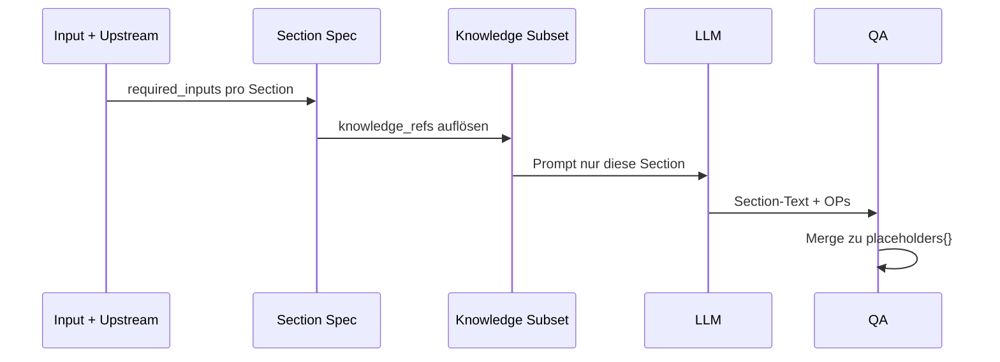

# SECTION_BASED_DOCUMENT_GENERATION_CONCEPT

**Stand:** 2026-06-02  
**Status:** Architektur-Vorgabe — **keine Bot-Implementierung** in diesem Schritt  
**Ziel:** Dokumente sectionweise planen, befüllen und prüfen — nicht als monolithischer LLM-Block.

---

## 1. Problem mit dem Ist-Modell

Heute:

1. Blueprint definiert `ai_blocks` (z. B. 6–9 große Platzhalter).
2. Ein LLM-Call füllt alle Blöcke in einem JSON.
3. `content_blocks.md` beschreibt Blöcke **flach**, nicht operativ pro Kapitel.

**Schwächen:**

- Schwer zu reviewen („nur Kapitel 5 prüfen“).
- Knowledge wird global geladen, nicht section-spezifisch.
- Upstream-Bezug pro Kapitel unklar.
- Publikums-/Einlass-Logik vermischt sich mit Notfall-Logik.

---

## 2. Zielmodell — Section als kleinste fachliche Einheit

### 2.1 Definition

Eine **Section** ist ein dokumentierbares Kapitel mit:

| Attribut | Inhalt |
|----------|--------|
| `section_id` | stabil, z. B. `ek.05.kommunikation` |
| `title` | Kapitelüberschrift im DOCX |
| `purpose` | 1–3 Sätze |
| `required_inputs[]` | Pflichtfelder (Keys aus `input_schema`) |
| `optional_inputs[]` | optionale Felder |
| `knowledge_refs[]` | Allowlist-Subset |
| `upstream_sections[]` | z. B. `sk.massnahmen` |
| `output_rules` | Stil, Länge, Tabellen ja/nein |
| `quality_criteria[]` | Reviewer-Checkliste |
| `typical_errors[]` | Anti-Patterns |
| `missing_data_policy` | immer `[OFFENER PUNKT]` |

### 2.2 Ablageort (Ziel)

```
knowledge/6_products/{produkt}/
├── 00_document_structure.md    # Gesamtgliederung + Reihenfolge
├── 01_required_inputs.md       # alle Felder (Formular-Wahrheit)
├── 02_section_mapping.md       # section_id ↔ placeholder ↔ template heading
├── 03_knowledge_mapping.md     # section_id ↔ knowledge paths
├── 04_output_rules.md          # globale Produktregeln
└── sections/
    └── {nn}_{slug}.md          # Section-Definition (YAML-Frontmatter + MD)
```

**Bestehendes `content_blocks.md`:** bleibt als **Kompatibilitätsschicht** bis alle Sections migriert sind.

---

## 3. Beispiel — Einsatzkonzept (9 Sections, aus Lieferpaket)

| # | Datei | Platzhalter (heute) | Zweck |
|---|-------|---------------------|--------|
| 1 | `01_allgemeine_angaben.md` | Teil von `EC_EINSATZBESCHREIBUNG` | Meta, Version, Auftraggeber |
| 2 | `02_auftrag_und_scope.md` | `EC_EINSATZBESCHREIBUNG` | Leistungsumfang SD |
| 3 | `03_objekt_und_einsatzort.md` | `EC_EINSATZBESCHREIBUNG` / Positionierung | Halle, Adresse, Zeiten |
| 4 | `04_personal_und_qualifikation.md` | `EC_KRAEFTE_UND_ROLLEN` | Rollen, Qualifikation (Prinzip) |
| 5 | `05_operative_durchfuehrung.md` | `EC_POSITIONIERUNG_UND_ABSCHNITTE` | Abschnitte, Lageaufgaben |
| 6 | `06_melde_und_berichtswesen.md` | `EC_KOMMUNIKATION` + `EC_DOKUMENTATION` | Meldewege, Wachbuch |
| 7 | `07_notfall_und_eskalation.md` | `EC_NOTFALLPLAN` | Räumung, Sanität, Eskalation |
| 8 | `08_anhang_und_nachweise.md` | Logistik + Nachweise | Ausrüstung, Anhänge |
| 9 | (aggregiert) | `EC_OFFENE_PUNKTE` | nur OP-Liste |

**Hinweis:** Heutige 9 `ai_blocks` können 1:1 bleiben; Sections sind **feinere** Planungsebene — Mapping in `02_section_mapping.md`.

---

## 4. Section-Lifecycle (Generierung)



### 4.1 Stufe S0 (heute)

- Ein Prompt, alle Blöcke.

### 4.2 Stufe S1 (empfohlen als nächster Schritt)

- **Ein** LLM-Call, aber User/System-Prompt explizit nach `sections/*.md` gegliedert.
- Jede Section im Prompt: Zweck, Inputs, Knowledge-Hinweis, Output-Regeln.
- Kein Code-Split nötig — nur bessere Prompt-Assembly aus Section-MD.

### 4.3 Stufe S2 (später)

- Pro Section optional eigener Call → `placeholders` merge.
- Vorteil: Token-Disziplin; Nachteil: Konsistenz / Kosten.

---

## 5. Input-Logik pro Section (Auftrag D)

Für **jede** Section in `01_required_inputs.md` und Section-MD dokumentieren:

| Quelle | Beispiel |
|--------|----------|
| **Kundeninput** | `event_location_address`, `security_staff_count` |
| **Upstream** | `SK_SCHUTZZIEL` wenn `upstream_sk_available` |
| **Knowledge** | `4_sources/dguv/crowd_veranstaltung.md` |
| **Regeln** | `10_rules/products/ec_rules.md` |
| **Verboten** | Frequenzen, Paragrafen, erfundene Kräfte |
| **Offene Annahme** | nur als `[OFFENER PUNKT]` |

---

## 6. Beispiel-Section: Publikums-/Zuschauerzusammensetzung

### 6.1 Einordnung

| Dokument | Section-ID (Vorschlag) | Platzhalter-Anteil |
|----------|------------------------|-------------------|
| SK | `sk.04.publikum` | `SK_GEFAEHRDUNGSANALYSE`, `SK_SCHUTZMASSNAHMEN` |
| EK | `ek.05.einlass_publikum` | `EC_POSITIONIERUNG`, `EC_ABLAUF` |
| ODA | `oda.03.verhalten_publikum` | `ODA_VERHALTEN` |

### 6.2 Eingaben (Checkliste)

- `expected_attendance` / `expected_attendees`
- `audience_profile` (Alter, Familien, Risikogruppen)
- `alcohol_served`
- `vip_expected`
- Konfliktpotenzial, Fan-Dynamik (wenn bekannt)
- `prior_incidents` / `special_risks`
- `entry_policy`
- Sprach-/Kulturbarrieren (optional)

### 6.3 Knowledge-Refs (nicht raten)

1. `4_sources/dguv/crowd_veranstaltung.md`
2. `4_sources/praxisleitfaeden/kampfsport_small_hall_event.md`
3. `8_guides/risk_patterns/crowd_dynamics.md` (GB-lean)
4. SDL `veranstaltungsschutz/subtypes/kampfsport.md`

### 6.4 Bot-Prüflogik (Ziel)

```
WENN expected_attendance fehlt → OP
WENN alcohol_served unbekannt UND Event-Typ Kampfsport → OP oder explizit "unbekannt"
LADE knowledge_refs
WENN Upstream SK.maßnahmen vorhanden → übernehmen (Auszug)
SONST formuliere Maßnahmen nur aus Input + Knowledge-Prinzipien
MARKIERE downstream: EK.einlass_publikum, ODA.verhalten
```

### 6.5 Output (Ziel)

- Beschreibung Publikumsstruktur (nur belegt)
- Risikoauswirkung (kurz)
- operative Maßnahmen (Einlass, Deeskalation, Meldung)
- keine erfundenen Demografien

---

## 7. Section ↔ Blueprint ↔ Template

| Ebene | Artefakt |
|-------|----------|
| Section-Definition | `sections/07_notfall_und_eskalation.md` |
| Mapping | `02_section_mapping.md` → `EC_NOTFALLPLAN` |
| Blueprint | `ai_blocks` enthält `EC_NOTFALLPLAN` |
| Word | `templates/ec_event_kampfsport.docx` Heading + `{EC_NOTFALLPLAN}` |

**Regel:** Template-Platzhalter bleiben stabil; Sections sind **interne** Planungseinheit.

---

## 8. Qualität pro Section

Jede Section-MD enthält:

```markdown
## Qualitätskriterien
- [ ] Keine erfundenen Zahlen
- [ ] Alle Pflicht-Inputs adressiert oder OP gesetzt
- [ ] Upstream-Bezug markiert („aus SK: …“) wenn genutzt

## Typische Fehler
- Großlagen-Narrativ ohne Input
- Polizeidispositiv ohne Auflage
```

Reviewer kann Section-für-Section abhaken (später Portal).

---

## 9. Was bei fehlenden Angaben passiert

| Situation | Verhalten |
|-----------|-----------|
| Pflichtfeld leer | `input_loader` → pre OP |
| Section-Pflichtfeld leer | Section-Text enthält `[OFFENER PUNKT: …]` |
| Upstream fehlt | Standalone: `missing_data_policy` aus `DOCUMENT_DEPENDENCY_MAP` |
| Knowledge fehlt im Repo | Blueprint-Loader-Fehler (harte Gate) |

---

## 10. Implementierungsreihenfolge (nur Konzept)

1. EK: alle `sections/*.md` + 4 Mapping-Dateien schreiben (Mensch/Fachkraft)
2. `context_builder`: optional Section-Prompt-Block aus MD (S1)
3. SK, GB, ODA analog
4. S2 nur wenn S1 Qualität nicht reicht

---

## 11. Verwandte Dokumente

- `DOCUMENT_DEPENDENCY_MAP.md`
- `TARGET_ARCHITECTURE_PROPOSAL.md`
- `GAP_ANALYSIS.md`
- `knowledge/6_products/einsatzkonzept/content_blocks.md` (Ist)
