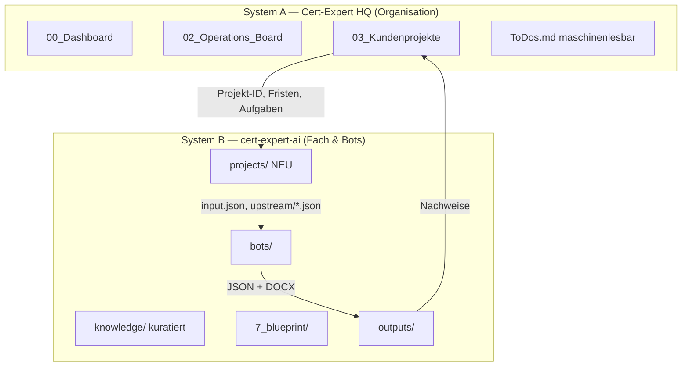

# TARGET_ARCHITECTURE_PROPOSAL — Zwei Systeme, eine Erweiterung

**Stand:** 2026-06-02  
**Prinzip:** Bestehende `cert-expert-ai`-Struktur **erweitern**, nicht ersetzen.

---

## 1. Zielbild (zwei verbundene Systeme)



| System | Zweck | Speicherort (Vorschlag) |
|--------|--------|-------------------------|
| **A — HQ** | Unternehmensgedächtnis, Kunden, Ops, To-dos | `Cert-Expert HQ/` (eigenes Root **oder** `cert-expert-ai/hq/`) |
| **B — AI Repo** | Norm-Wissen, Bots, Blueprints, Generierung | `cert-expert-ai/` (bestehend) |

---

## 2. System A — Cert-Expert HQ (Integration)

### 2.1 Zielordner (vom Nutzer vorgegeben — übernehmen)

```
Cert-Expert HQ/
├── 00_Dashboard/
├── 01_Master_Dump/
├── 02_Operations_Board/
├── 03_Kundenprojekte/
│   ├── TeamFlex/
│   ├── Wolf_Street/
│   ├── SecuGuard/
│   ├── Schutzritter/
│   ├── Checkpoint_Regional/
│   ├── ZT_Security/
│   └── LC_Security/
├── 04_Vertrieb/
├── 05_Forderungen/
├── 06_Software/
├── 07_DFSS/
├── 08_Vorlagen/
└── 09_Archiv/
```

### 2.2 Standard pro Kundenprojekt (Pflicht-Set)

| Datei | Zweck |
|-------|--------|
| `Status.md` | Ampel, Phase, Blocker |
| `ToDos.md` | **Maschinenlesbare** Aufgaben (Telegram-Ziel) |
| `Kommunikation.md` | Log Kunde/Behörde |
| `Audit_2026.md` | Audit-Tracking |
| `Dokumente_und_Nachweise.md` | Links zu GB/SK/EK/ODA |
| `Lessons_Learned.md` | Retrospektive |

Details To-do-Schema: `MOBILE_INPUT_TODO_ARCHITECTURE.md`.

### 2.3 Verknüpfung zu System B

| HQ-Element | Bot-Repo-Element |
|------------|------------------|
| `03_Kundenprojekte/TeamFlex/` | `projects/teamflex/{event_slug}/` |
| `Dokumente_und_Nachweise.md` | Verweise auf `outputs/` oder `projects/.../documents/` |
| `ToDos.md` Eintrag „SK fehlt“ | Status in `projects/.../status.json` |

**Empfehlung:** `project_id` = slug aus HQ-Ordnername (`TeamFlex` → `teamflex`).

---

## 3. System B — Erweiterung der bestehenden Struktur

### 3.1 Beibehalten (unverändert im Kern)

```
knowledge/
├── 1_standards/      # CEKS — nur Mensch/Cursor
├── 2_regulations/    # Bot-Überblicke
├── 3_sdls/
├── 4_sources/
├── 6_products/       # ERWEITERN (siehe unten)
├── 7_blueprint/
├── 8_guides/
├── 10_rules/
├── 11_examples/
└── BOT_CONTEXT_MAP.md

shared/               # Pipeline
bots/                 # GB, SK, EK, ODA (später)
prompts/
templates/
inputs/               # globale Fixtures + PFLICHTANGABEN
docs/                 # Architektur (dieser Audit)
```

### 3.2 Neu / zu ergänzen (minimal-invasiv)

#### A) `projects/` (fehlt heute — **P0**)

```
projects/
└── {project_id}/
    └── events/
        └── {event_id}/
            ├── project_meta.json      # Kunde, SDL, Datum, Status
            ├── input_sk.json          # aktiver Input je Blueprint
            ├── input_ec.json
            ├── upstream/
            │   └── sk_output.json     # optional
            ├── documents/
            │   ├── sk_*.json
            │   └── sk_*.docx
            └── open_points.md         # Aggregat für Reviewer
```

**Regel:** Alles Kundenspezifische hier — **nicht** in `knowledge/`.

#### B) Section-Pakete unter `6_products/` (**P0**)

Pro Produkt (Beispiel `einsatzkonzept/`):

```
einsatzkonzept/
├── purpose.md                    # existiert
├── content_blocks.md             # existiert (Legacy-Block-API)
├── 00_document_structure.md      # NEU
├── 01_required_inputs.md         # NEU — Quelle für Checklisten
├── 02_section_mapping.md         # NEU — Section ↔ EC_* ↔ Template
├── 03_knowledge_mapping.md       # NEU — Section ↔ 4_sources/…
├── 04_output_rules.md            # NEU
└── sections/
    ├── 01_allgemeine_angaben.md
    └── …
```

GB/SK/ODA analog (`Gefährdungsbeurteilung/`, `sicherheitskonzept/`, `oda/`).

#### C) `inputs/checklists/` (**P1**)

Einheitliche Namen (Alias zu PFLICHTANGABEN):

```
inputs/checklists/
├── GBU_Input_Checkliste.md
├── SK_Input_Checkliste.md
├── EK_Input_Checkliste.md
└── ODA_Input_Checkliste.md
```

Bestehende `PFLICHTANGABEN_*.md` → symlink oder Redirect-Kopfzeile „Alias: SK_Input_Checkliste“.

#### D) `orchestrator/` (**P2**, nach Freigabe)

```
orchestrator/
├── flow_runner.py          # lädt upstream, enriched input
├── section_runner.py       # optional sectionweise
└── README.md
```

**Nicht** vor Architekturfreigabe implementieren.

#### E) `hq/` optional im gleichen Repo

Wenn HQ physisch getrennt bleibt: nur `projects/_registry.json` mit Pfad zu externem HQ.

---

## 4. Dokument-Bots — Zielarchitektur (ohne Überladung)

### 4.1 Blueprint bleibt Steuerzentrale

`knowledge/7_blueprint/{id}.json` behält:

- `context_modules` / `pflichten.lektuere`
- `input_schema`
- `ai_blocks` (oder später `sections[]` mit block_ids)
- `upstream` / `downstream` / `modes`
- `qa_rules`

### 4.2 Section-Layer sitzt **unter** 6_products

- Blueprint referenziert **weiterhin** flache Module (Übergangsphase).
- Zusätzlich: `section_mapping` definiert, welche Knowledge-Dateien pro Section geladen werden (später conditional_modules pro Section).

### 4.3 Generierungsstufen (Evolution)

| Stufe | Beschreibung | Status |
|-------|--------------|--------|
| **S0** | Ein Call, alle `ai_blocks` | heute |
| **S1** | Ein Call, Prompt nach `sections/` strukturiert | nächster Schritt |
| **S2** | Multi-Call pro Section + Merge | später |
| **S3** | Orchestrator + Flow + dependency QA | später |

**Freigabe-Ziel für Bots:** mindestens **S1** vor „finaler“ ODA/Unterweisung.

---

## 5. Namens- und Produktkonvention (Harmonisierung)

| Fachlich | Code / Blueprint | Ordner 6_products | Bot-Ordner |
|----------|------------------|-------------------|------------|
| GBU / GB | `gb_*` | `Gefährdungsbeurteilung/` | `01_gefaehrdungsbeurteilung/` |
| SK | `sk_*` | `sicherheitskonzept/` | `02_sicherheitskonzept/` |
| EK | `ec_*` (behalten) | `einsatzkonzept/` | `03_einsatzkonzept/` |
| ODA | `oda_*` | `oda/` | `04_oda/` |

**Dokumentation:** ein Glossar `docs/NAMESPACE_GB_SK_EC_ODA.md` (kurz) — optional P1.

---

## 6. CEKS vs. Bots — harte Grenze (beibehalten)

| Inhalt | Ort | Bot |
|--------|-----|-----|
| DIN 77200 Profile, Qualifikation, Governance | `1_standards/` | nein |
| Überblicke, Extrakte | `2_regulations/`, `4_sources/` | ja (Allowlist) |
| Kundenprojekt | HQ / `projects/` | Input only |

---

## 7. Was **nicht** neu erfunden werden soll

- `shared/blueprint_loader` + `context_builder` Pipeline
- `pflichten_validator` Drei-Säulen-Modell
- `BOT_CONTEXT_MAP.md` als menschlicher Index
- Kampfsport-Blueprints als Referenz (`*_event_kampfsport`)
- DOCX-Renderer (`shared/renderer/`)

---

## 8. Migrationspfad (ohne Big-Bang)

| Phase | Inhalt | Dauer (grob) |
|-------|--------|--------------|
| **0** | Dieser Audit + Freigabe | jetzt |
| **1** | `projects/` Schema + eine Beispiel-Projektakte (K1 Event) | kurz |
| **2** | Section-MD für EK (9 Sections) + `02_section_mapping.md` | mittel |
| **3** | Input-Checklisten vereinheitlichen + `01_required_inputs.md` | kurz |
| **4** | SK/GB Section-Pakete | mittel |
| **5** | HQ-Ordner anlegen + ToDo-Schema | parallel möglich |
| **6** | Flow-Orchestrator minimal | nach Inputs gefüllt |
| **7** | ODA Blueprint + Sections | danach |

---

## 9. Entscheidungen für Marwan (vor Implementierung)

| # | Frage | Optionen |
|---|--------|----------|
| 1 | HQ Ort | externes `Cert-Expert HQ/` vs. `cert-expert-ai/hq/` |
| 2 | GBU vs. GB in Checklisten | Nutzer „GBU“ in Dateinamen, Code bleibt `gb` |
| 3 | Section-Stufe S1 vs. S2 | Empfehlung: **S1** zuerst |
| 4 | Fokus nächste Woche | Inputs befüllen vs. HQ-Struktur vs. EK-Sections |
| 5 | Kräfte-Testfall K1 | 2 vs. 4 SMA als Standard-Referenz |

---

## 10. Verwandte Dokumente

- `STRUCTURE_AUDIT.md`
- `GAP_ANALYSIS.md`
- `DOCUMENT_DEPENDENCY_MAP.md`
- `SECTION_BASED_DOCUMENT_GENERATION_CONCEPT.md`
- `MOBILE_INPUT_TODO_ARCHITECTURE.md`
- `NEXT_STEPS.md`
