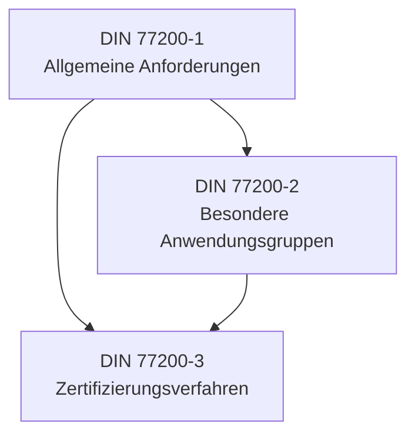
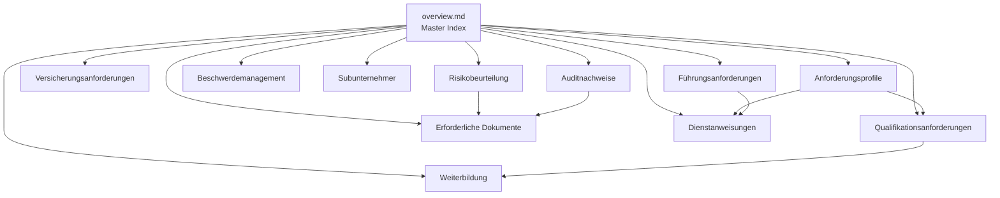
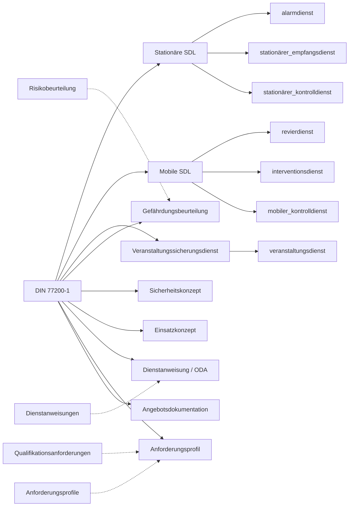
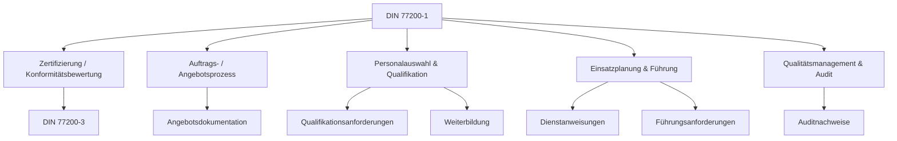

# DIN 77200-1 — Master Index

Autoritative Navigations-, Routing- und Modul-Governance-Datei für Cert-Expert AI gemäß **CEKS v1** (Cert-Expert Knowledge Standard). **Kein** Normtext, **kein** Implementierungsguide.

> **Pflicht vor jedem neuen Modul:** Diese `overview.md` lesen → Governance, Linking, Metadata und Retrieval hier befolgen.

| Schicht | Pfad |
|---------|------|
| Master Index (diese Datei) | `knowledge/1_standards/DIN 77200-1/overview.md` |
| Detailmodule | `knowledge/1_standards/DIN 77200-1/<Modul>.md` (Unicode-Dateiname, z. B. `Führungsanforderungen.md`) |
| SDL-Fachwissen | `knowledge/3_sdls/<sdl_slug>/` |
| Regelwerke | `knowledge/2_regulations/` |
| Beispiele | `knowledge/10_examples/` |
| Projektdaten | `projects/` |

## Inhaltsverzeichnis

1. [Retrieval Governance](#retrieval-governance)
2. [Module Governance](#module-governance)
3. [Linking Strategy](#linking-strategy)
4. [Knowledge Graph](#knowledge-graph)
5. [Module Taxonomy](#module-taxonomy)
6. [Future Expansion](#future-expansion)
7. [Normstruktur (Index)](#normstruktur-index)
8. [Zentrale Themenbereiche](#zentrale-themenbereiche)
9. [Verknüpfte Dokumenttypen](#verknüpfte-dokumenttypen)
10. [Verknüpfte SDLs](#verknüpfte-sdls)
11. [Verknüpfte Prozesse](#verknüpfte-prozesse)
12. [Final Rule](#final-rule)

---

## Retrieval Governance

### Wissens-Schichten (Lade-Reihenfolge)

| Schicht | Ort | Enthält | Lade wenn |
|---------|-----|---------|-----------|
| **Routing** | `overview.md` | Normindex, Modul-Routing, Audit-/Doku-Anker | Erstzugriff, Routing, Kontextbudget knapp |
| **Implementation** | `<related_module>.md` | Umsetzungswissen zu einem Normthema | Fokus auf ein Anforderungsfeld (z. B. 4.19) |
| **Beispiele** | `knowledge/10_examples/` | Stil- und Strukturbeispiele (generisch) | Schreibhilfe, kein normatives Routing |
| **Projekt** | `projects/` | Kunden-, Auftrags-, Einsatzdaten | Nur im Projekt-/Bot-Laufzeitkontext |

`overview.md` ist **Routing Layer** — wählt Zielmodule und Schichten, ersetzt keine Detailmodule.

### Wann `overview.md` laden

- Routing: SDL, Dokumenttyp, Prozess oder Detailmodul bestimmen
- Normstruktur-Index (Kap. 1–4, Anhang A) ohne Implementierungstiefe
- Metadata-Filter: `knowledge_level: master`, `retrieval_priority: high`

### Wann Detailmodule laden

- Konkretes Normthema vertiefen (`related_modules` in YAML)
- GB/SK/EC/ODA-Generierung mit normativem Teilbezug
- Audit-Fokus auf einen Abschnitt (z. B. nur Qualifikation → `Qualifikationsanforderungen.md`)

### Wann andere Schichten laden

- **SDL** (`knowledge/3_sdls/`): operative Domänenlogik je Leistungsbereich
- **Beispiele**: Formulierung und Blockstruktur — nie als Normquelle
- **Projekt**: kundenspezifische Fakten — nie in `knowledge/` mischen

### RAG-Routing

| Stufe | Ziel | `chunk_strategy` |
|-------|------|------------------|
| 1 | `overview.md` — Abschnitt nach `##` | `hierarchical` / `recommended_chunk_size: section` |
| 2 | Detailmodul — thematischer Chunk | modul-intern |
| 3 | SDL / Produkt / Beispiel | blueprint-gesteuert |

**Halluzinationsgrenze:** Struktur und Zuordnung only. Pflichten aus Detailmodul oder Primärquelle (`source_documents`); Lücken → `[OFFENER PUNKT]`.

---

## Module Governance

Binding standard for all detail modules: **CEKS v1**. This `overview.md` is the authoritative source for module structure, retrieval architecture, linking, metadata, and governance.

### Workflow before creating a module

1. Read `[[overview]]` (this file)
2. Apply [Retrieval Governance](#retrieval-governance) and [Linking Strategy](#linking-strategy)
3. Place module per [Module Taxonomy](#module-taxonomy)
4. Use YAML template and body structure below
5. Link back to `[[overview]]` and peer modules

### Mandatory YAML (detail modules)

```yaml
---
type: standard_module
standard: DIN 77200-1
module: ""
module_id: ""
status: draft
language: de
source_status: curated
knowledge_standard: CEKS_v1
parent_standard: DIN 77200-1
knowledge_path: ""
source_documents:
  - inputs/raw_standards/din/DIN_77200_1_2022
  - inputs/raw_standards/din/DIN_77200_2_2020
norm_references: []
related_modules: []
related_processes: []
related_document_types: []
related_sdls: []
tags: []
created_for: cert_expert_ai
---
```

| Field | Rule |
|-------|------|
| `module` | Deutscher Anzeigetitel (z. B. `Führungsanforderungen`) |
| `module_id` | Stabile ASCII-ID für Routing/Bots (z. B. `leadership_requirements`) — **unveränderlich** |
| `knowledge_path` | Vollständiger Repo-Pfad mit **Unicode-Dateiname** (z. B. `…/Führungsanforderungen.md`) |
| `source_documents` | Traceability to primary source — required |
| `norm_references` | Chapter/annex anchors only — **no** norm full text |
| `related_modules` | `module_id`-Werte der Peer-Module (ASCII), nicht Dateinamen |
| `related_processes` | Subset of master list or topic-specific |
| `related_document_types` | GB, SK, EC, ODA, … as applicable |
| `related_sdls` | When SDL-specific relevance exists |
| Wikilinks | `[[overview]]` mandatory; Peer-Links: **deutscher Dateiname ohne Endung** (z. B. `[[Führungsanforderungen]]`, `[[Erforderliche Dokumente]]`) |

Optimized for: Obsidian, Dataview, Wikilinks, Qwen, LM Studio, future RAG.

### Content layers (strict separation)

Each section must be assignable to **one** primary layer:

| Layer | Content |
|-------|---------|
| **Normative requirement** | What the standard requires (concise, traceable) |
| **Audit evidence** | What auditors expect to see as proof |
| **Practical implementation** | How organizations typically implement (non-normative) |
| **Cert-Expert interpretation** | How Cert-Expert applies this in bots, documents, reviews |

Do not mix layers in one paragraph. Do not copy large portions of standards.

### Mandatory body structure (CEKS v1)

Every detail module **must** use these sections in order (**German headings**):

```markdown
# [Modultitel]

## Zweck

## Normkontext

## Anforderungsübersicht

## Audit-Relevanz

## Audit-Nachweise

## Erforderliche Dokumente

## Typische Auditorfragen

## Typische Abweichungen

## Risiken

## Cert-Expert-Anwendung

## Verwandte Module

## Verwandte Prozesse

## Verwandte SDLs

## Quellen

## Offene Punkte
```

Unterabschnitte in **Anforderungsübersicht**: `### Normative Anforderung`, `### Praxisumsetzung` (nicht normativ).

| Section | Primary layer |
|---------|---------------|
| Zweck, Normkontext, Anforderungsübersicht | Normative requirement |
| Audit-Relevanz, Audit-Nachweise, Erforderliche Dokumente, Typische Auditorfragen, Typische Abweichungen | Audit evidence |
| Risiken | Normative + audit (state risks of non-compliance) |
| Cert-Expert-Anwendung | Cert-Expert interpretation |
| Verwandte Module / Prozesse / SDLs | Linking (YAML + Wikilinks) |
| Quellen | Traceability |
| Offene Punkte | Curation backlog |

### Sprach- und Namensregel (Deutsch-first, Unicode)

Alle Detailmodule der Wissensbasis sind **deutschsprachig** mit **korrekter deutscher Rechtschreibung** (Umlaute, ß):

| Element | Regel |
|---------|--------|
| **Dateiname** | Deutsch mit **Umlauten** (Unicode); Leerzeichen erlaubt — z. B. `Führungsanforderungen.md`, `Stationäre Sicherungsdienstleistungen.md`, `Erforderliche Dokumente.md` |
| **`module_id`** | ASCII, snake_case, stabil (z. B. `leadership_requirements`) — für YAML, Bots, Blueprints |
| **`module`** | Deutscher Anzeigetitel = H1 = Dateiname ohne `.md` |
| **Überschriften** | Deutsch (CEKS-Abschnitte unten) |
| **Inhalt** | Deutsch; Terminologie DIN 77200, ISO (deutsch), DEKRA- und Kundenpraxis |
| **Normbegriffe** | Nicht übersetzen (Führungskraft, Einsatzleitung, Dienstanweisung, SDL, Nachweis, Gefährdungsbeurteilung, …) |
| **YAML-Schlüssel** | Englisch (`type`, `module`, `module_id`, `related_modules`, …) |
| **YAML-Werte** | `module_id` / `related_modules`: ASCII; `related_sdls` / `related_processes`: ASCII-Slugs; `module`: Deutsch |
| **Wikilinks** | Deutscher Dateiname ohne Endung: `[[Führungsanforderungen]]`, `[[stationärer_empfangsdienst]]`, `[[Erforderliche Dokumente]]` |

Referenzqualität: [[Führungsanforderungen]], [[Qualifikationsanforderungen]].

**Geplante Module (Dateiname ↔ `module_id`):**

| Datei | `module_id` |
|-------|-------------|
| `Führungsanforderungen.md` | `leadership_requirements` |
| `Qualifikationsanforderungen.md` | `qualification_requirements` |
| `Weiterbildung.md` | `further_training` |
| `Versicherungsanforderungen.md` | `insurance_requirements` |
| `Erforderliche Dokumente.md` | `required_documents` |
| `Beschwerdemanagement.md` | `complaint_management` |
| `Subunternehmer.md` | `subcontractors` |
| `Risikobeurteilung.md` | `risk_assessment` |
| `Dienstanweisungen.md` | `site_instruction` |
| `Auditnachweise.md` | `audit_evidence` |

### Writing rules (CEKS v1)

- Concise expert summaries — quality over quantity
- Preserve traceability via `norm_references` and `Sources`
- Reusable across bots, audits, and document products
- Think: senior auditor, consultant, knowledge architect
- Objective: professional knowledge system — **not** personal notes
- Gaps or unverified claims → `Open Points` / `[OFFENER PUNKT]`
- **Sprache:** Deutsch-first, Unicode-Dateinamen (siehe [Sprach- und Namensregel](#sprach--und-namensregel-deutsch-first-unicode))

Detail modules **link back** to `[[overview]]`. The Master Index links **forward** to detail modules and SDLs.

---

## Linking Strategy

Offizielle Cert-Expert-Verknüpfungshierarchie (Priorität absteigend):

```
YAML metadata
    ↓
Wikilinks
    ↓
Folder structure
```

| Layer | Nutzung |
|-------|---------|
| **YAML metadata** | RAG-Filter, Blueprint `context_modules`, Dataview-Queries, automatisches Routing |
| **Wikilinks** | Obsidian-Graph, manuelle Kuratierung, Reviewer-Navigation |
| **Folder structure** | Konvention für Menschen und Repo-Layout; **kein** Ersatz für YAML oder Wikilinks |

Ordner spiegeln Taxonomie (`1_standards`, `3_sdls`, `5_products`). Automatisierung und Bots lesen **YAML zuerst**, Wikilinks ergänzen.

---

## Knowledge Graph

Beziehungskarte für Cert-Expert Knowledge Layer (normativ → operativ → dokumentarisch).

### Normenreihe DIN 77200



### Master-Index → Themenmodule



### Norm → SDL → Dokumenttypen



### Prozesse & Nachweise



---

## Module Taxonomy

Geplante Detailmodule (`module_creation_status: master_ready` am Index). Wikilink-Ziel = **Dateiname ohne Endung**; Routing/Bots = **`module_id`**.

### Normative Anforderungen

| `module_id` | Modul | Normanker | Audit | Dokumentation |
|-------------|-------|-----------|-------|---------------|
| `qualification_requirements` | [[Qualifikationsanforderungen]] | 4.19.1, Anhang A | Qualifikationsmatrix vs. Profil | Zeugnisse, §34a |
| `requirements_profile` | [[Anforderungsprofile]] | 4.11, Anhang A, Anhang C | Profil first; AG/AN-Abstimmung; Jahresprüfung | Anforderungsprofil, Qualifikationsmatrix |
| — | [[qualifications/README\|Qualifikationssystem V2+]] · [[qualifikationssystem/README\|V1 Legacy]] | 4.19.1, 4.19.2, Katalog, Matrix | Freigabeentscheid — V2: `qualifications/`, V1: 01–05 |
| `insurance_requirements` | [[Versicherungsanforderungen]] | 4.3, 4.4 | Police, Deckungssummen | Versicherungsnachweise |
| `subcontractors` | [[Subunternehmer]] | 4.13 | Sub-Prüfung, AG-Zustimmung (4.13) | Personenlisten, Prüfberichte |

### Operative Anforderungen

| `module_id` | Modul | Normanker | Audit | Dokumentation |
|-------------|-------|-----------|-------|---------------|
| `leadership_requirements` | [[Führungsanforderungen]] | 4.2, 4.24 | Einsatzleitung, Führungsnachweise | Organigramm, Stellenbeschreibungen |
| `site_instruction` | [[Dienstanweisungen]] | 4.12, 3.13 | Verfügbarkeit, Prüfzyklus | Dienstanweisung / ODA |
| `risk_assessment` | [[Risikobeurteilung]] | 4.7, 4.8 | GB je Leistungsort | Gefährdungsbeurteilung |

### Management-System-Anforderungen

| `module_id` | Modul | Normanker | Audit | Dokumentation |
|-------------|-------|-----------|-------|---------------|
| `complaint_management` | [[Beschwerdemanagement]] | 4.5 | Beschwerdeverfahren | Reklamationsakten |
| `further_training` | [[Weiterbildung]] | 4.19.2 | UE-Nachweis, Konzept | Weiterbildungsplan |

### Nachweise & Dokumentation

| `module_id` | Modul | Normanker | Audit | Dokumentation |
|-------------|-------|-----------|-------|---------------|
| `required_documents` | [[Erforderliche Dokumente]] | 4.1, 4.20, 4.23 | Nachweisportfolio | Angebotsmappe, Meldewesen |
| `audit_evidence` | [[Auditnachweise]] | 4.1, 4.6, 4.18 | QMS, Kontrollsysteme | Auditberichte, Konformität |

**SDL-Platzhalter** (strukturell, `type: standard_module`): `Stationäre Sicherungsdienstleistungen`, `mobile_sicherungsdienstleistungen`, `interventionsdienst`, `veranstaltungsdienst` — Routing zu [[overview]] und `knowledge/3_sdls/`. *(Kein aktives Modul `allgemeine_anforderungen` in DIN 77200-1 — siehe inaktive Platzhalter unter `DIN 77200-2/`.)*

---

## Future Expansion

Reservierte Master-Indizes (`knowledge/1_standards/`) — **ohne Inhalt**, nur Strukturplatz:

| Standard | Zielpfad | Status |
|----------|----------|--------|
| DIN 77200-2 | `DIN 77200-2/` | Primärquelle in `inputs/raw_standards/DIN/` — Wissensmodule **inaktiv** |
| DIN 77200-3 | `DIN 77200-3/overview.md` | reserviert |
| ISO 9001 | `ISO 9001/overview.md` | reserviert |
| ISO 14001 | `ISO 14001/overview.md` | reserviert |
| ISO 45001 | `ISO 45001/overview.md` | reserviert |

DIN 77200-1 bleibt **Parent** für SDL-Basis; 77200-2 erweitert Anwendungsgruppen; 77200-3 für Konformitätsbewertung.

---

## Normstruktur (Index)

Kapitelanker für Routing, Audit- und Dokumentations-Mapping. **Keine** inhaltliche Normwiedergabe.

## Zweck der Norm

DIN 77200-1 legt **allgemeine Mindestanforderungen** an Sicherheitsdienstleister für die Planung und Erbringung von Sicherungsdienstleistungen (SDL) fest. Sie dient Auftraggebern, Auftragnehmern und Konformitätsbewertungsstellen als gemeinsamer Referenzrahmen für Leistungskriterien, Nachweisführung und einheitliches Verständnis des Leistungsumfangs.

## Anwendungsbereich

Gilt für **Sicherheitsdienstleister** (Anbieter/Auftragnehmer) und **Auftraggeber** von SDL sowie für Stellen, die Konformitätsbewertungen nach dieser Norm durchführen.

**Im Geltungsbereich enthaltene SDL-Gruppen:**

| Gruppe | SDL-Typen (Normbegriffe) |
|--------|--------------------------|
| Stationäre SDL | Alarmdienst, Empfangsdienst, Kontrolldienst |
| Mobile SDL | Revierdienst, Interventionsdienst, Kontrolldienst |
| Veranstaltung | Veranstaltungssicherungsdienst |

Besondere Leistungsbereiche → **DIN 77200-2**. Zertifizierungsverfahren → **DIN 77200-3**.

---

## Kapitelstruktur

### Vorwort

- **Thema:** Normenherkunft (NADL), Patent-Hinweis, Überblick DIN-77200-Reihe, Änderungen gegenüber 2017-11
- **Relevanz für Audits:** Kontext für Gültigkeit und Reihenfolge der Normteile
- **Relevanz für Dokumentation:** Versionsbezug bei Zertifizierung und Vertragsreferenzen

### Einleitung

- **Thema:** Zweck der SDL (Prävention, Gefahrenabwehr, Schadensvermeidung); SDL-Begriffsdefinitionen; Rolle von Anhang A (Anforderungsprofile); Verweis auf DIN 77200-2/-3
- **Relevanz für Audits:** Begründung der SDL-Taxonomie und Anforderungsprofile
- **Relevanz für Dokumentation:** Einordnung von Anforderungsprofilen in Ausschreibung und Vertrag

### Kapitel 1 — Anwendungsbereich

- **Thema:** Adressaten; Geltung für Anbieter, AN, AG, Prüfstellen; Eignung für Angebotsdokumentation; Auflistung der SDL-Gruppen
- **Relevanz für Audits:** Abgrenzung des Zertifizierungs- und Prüfumfangs
- **Relevanz für Dokumentation:** Vertrags- und Angebotsbezug; SDL-Klassifikation in Auftragsunterlagen

### Kapitel 2 — Normative Verweisungen

- **Thema:** DIN EN 15602 (Terminologie)
- **Relevanz für Audits:** Terminologie-Konsistenz mit EN 15602
- **Relevanz für Dokumentation:** Begriffsverwendung in Dienstanweisungen und Profilen

### Kapitel 3 — Begriffe

#### 3.1 Sicherheitsdienstleister

- **Thema:** Organisation als SDL-Auftragnehmer
- **Relevanz für Audits:** Identifikation des prüfpflichtigen Unternehmens
- **Relevanz für Dokumentation:** Vertragsparteien, Organigramm

#### 3.2 Sicherungsdienstleistung (SDL)

- **Thema:** Schutz von Personen, Eigentum und Rechtsgütern durch AN und Hilfspersonen
- **Relevanz für Audits:** Leistungsdefinition im Prüfumfang
- **Relevanz für Dokumentation:** Leistungsbeschreibung in Vertrag und Angebot

#### 3.3 Alarmdienst

- **Thema:** Stationäre Kontrolle via technische Systeme; Alarmverfolgung
- **Relevanz für Audits:** SDL-spezifische Anforderungsprofile (Anhang A)
- **Relevanz für Dokumentation:** Dienstanweisung, Anforderungsprofil

#### 3.4 Empfangsdienst

- **Thema:** Repräsentative Besucherbetreuung; Zugangsprüfung
- **Relevanz für Audits:** Qualifikationsmatrix Anhang A
- **Relevanz für Dokumentation:** Profil, Sprachanforderungen

#### 3.5 Revierdienst

- **Thema:** Mobile Kontrolle an mehreren Objekten für mehrere AG
- **Relevanz für Audits:** Nachweis von Kontrollgängen (4.18)
- **Relevanz für Dokumentation:** Einsatzplanung, Objektbeschreibungen (4.25)

#### 3.6 Interventionsdienst

- **Thema:** Maßnahmen bei nicht-regelmäßigen Ereignissen innerhalb definierter Frist
- **Relevanz für Audits:** Schematisches Regelwerk (4.12); Interventions-Schulung (4.19.1)
- **Relevanz für Dokumentation:** Interventionsanweisungen, Einsatzkonzept

#### 3.7 Kontrolldienst

- **Thema:** Kontrolle an definiertem Ort; stationär oder mobil zuordenbar
- **Relevanz für Audits:** Doppelzuordnung stationär/mobil beachten
- **Relevanz für Dokumentation:** Profil je Einsatzart

#### 3.8 Veranstaltungssicherungsdienst

- **Thema:** SDL bei Veranstaltungen (Kontrollen, Streifen, Alarme)
- **Relevanz für Audits:** **77200-1:** SDL-Typ **≠** automatisch SK/EK — **Auslöser** (Vertrag, AG-Vorgabe, Gefährdung, …) prüfen; Abgrenzung zu **77200-2 Kap. 5** (besondere Sicherheitsrelevanz)
- **Relevanz für Dokumentation:** **Einfach:** Profil → DI · **Mit Auslösern:** SK → Profil → EK → DI · **77200-2 Kap. 5:** SK (AG, muss) → Profil → EK (AN, muss) → DI

#### 3.9–3.22 Weitere Begriffe

| Nr. | Begriff | Audit-/Dokumentationsrelevanz |
|-----|---------|--------------------------------|
| 3.9 | Sicherheitsmitarbeiter (SMA) | Personalnachweise (Kap. 4.1, 4.14) |
| 3.10 | Einsatzkraft | Qualifikation Anhang A; Einweisung (4.25) |
| 3.11 | Führungskraft | Anforderungen 4.24; Qualifikation 4.19.1 |
| 3.12 | Einsatzleitung | Organisationsstruktur 4.2; Kommunikation 4.17 |
| 3.13 | Dienstanweisung | Vertragsbestandteil; Prüfzyklus 4.12 |
| 3.14 | Veranstaltung | Abgrenzung Veranstaltungssicherungsdienst |
| 3.15 | Auszubildender | Einsatzregeln 4.26 |
| 3.16 | Praktikant | Einsatzregeln 4.26 |
| 3.17 | Schulung | Abgrenzung zu Einweisung/Weiterbildung |
| 3.18 | Einweisung | 4.14.5; nicht als Weiterbildungszeit |
| 3.19 | Training | Aufrechterhaltung von Fertigkeiten |
| 3.20 | Einsatzkonzept (EK) | **77200-1:** Angebot 4.23, Betrieb kontextabhängig · **77200-2:** AN **muss** (Kap. 4) |
| 3.21 | Auftraggeber (AG) | Vertragspartner; Informationspflichten |
| 3.22 | Auftragnehmer (AN) | Nachweispflichten; QM/RM |

### Kapitel 4 — Allgemeine Anforderungen

#### 4.1 Zu erbringende Nachweise

- **Thema:** Nachweise für Unternehmen (Register, Steuer, SV, Datenschutz, Verschwiegenheit, Mindestlohn, dokumentierte Verfahren) und Mitarbeiter (§34a GewO, Einweisung, Datenschutz, Verschwiegenheit)
- **Relevanz für Audits:** **Kernprüfbereich** — Nachweisportfolio bei Zertifizierung und AG-Besichtigung
- **Relevanz für Dokumentation:** Nachweisregister, Personalakten, Verfahrensanweisungen

#### 4.2 Organisationsstruktur

- **Thema:** SDL-orientierte Unternehmensführung; Einsatzleitung; Organigramm; Stellenbeschreibungen Führungskräfte
- **Relevanz für Audits:** Struktur- und Führungsnachweis
- **Relevanz für Dokumentation:** Organigramm, Stellenbeschreibungen

#### 4.3 Versicherung

- **Thema:** Betriebshaftpflicht; Mindestdeckungssummen; Nachweispflicht gegenüber AG
- **Relevanz für Audits:** Versicherungsnachweise, Deckungsumfang
- **Relevanz für Dokumentation:** Police, Beitragsnachweise

#### 4.4 Haftung

- **Thema:** Vertragliche Haftungsregelung; Begrenzung bei einfacher Fahrlässigkeit
- **Relevanz für Audits:** Vertragskonformität
- **Relevanz für Dokumentation:** Vertragsklauseln, Haftungsvereinbarungen

#### 4.5 Beschwerdemanagement

- **Thema:** Dokumentiertes Beschwerdeverfahren (z. B. ISO-9001-Bezug)
- **Relevanz für Audits:** Verfahrensnachweis, Bearbeitungsprotokolle
- **Relevanz für Dokumentation:** Beschwerdeprozess, Reklamationsakten

#### 4.6 Qualitätsmanagement

- **Thema:** QMS-Nachweis; regelmäßige Audits; institutionalisierte Besprechungen
- **Relevanz für Audits:** QMS-Zertifikat oder gleichwertiger Nachweis
- **Relevanz für Dokumentation:** QM-Handbuch, Auditberichte, Protokolle

#### 4.7 Risikomanagement

- **Thema:** Erkennung und Steuerung betrieblicher Risiken; kritische Prozesse
- **Relevanz für Audits:** Risikoanalyse, Maßnahmenpläne
- **Relevanz für Dokumentation:** Risikoregister, Prozessbeschreibungen

#### 4.8 Arbeits- und Gesundheitsschutz

- **Thema:** Organisierter AGS; **Gefährdungsbeurteilung je Leistungsort**; Unterweisung/Belehrung
- **Relevanz für Audits:** GB-Nachweise, Umsetzungsnachweise
- **Relevanz für Dokumentation:** **GB**, Maßnahmenkatalog, Unterweisungsnachweise

#### 4.9 Geschäftsräume

- **Thema:** Kenntliche Geschäftsräume; Aufbewahrung SDL-Akten, Personal, Objektdaten, Dienstanweisungen
- **Relevanz für Audits:** Besichtigung, Aktenführung
- **Relevanz für Dokumentation:** Archivierung, Verfügbarkeit am Leistungsort

#### 4.10 Verträge

- **Thema:** Schriftliche Verträge/Auftragsbestätigungen; Inhalt (Befugnisse, Ansprechpartner); Dienstanweisung als Vertragsbestandteil
- **Relevanz für Audits:** Vertragsvollständigkeit
- **Relevanz für Dokumentation:** Verträge, Auftragsbestätigungen

#### 4.11 Anforderungsprofile

- **Thema:** AG/AN-Abstimmung der SDL-Tätigkeiten gemäß Anhang A; Vertragsbestandteil; jährliche Überprüfung; Basis für Aus-/Weiterbildung
- **Relevanz für Audits:** Profilabgleich mit eingesetztem Personal
- **Relevanz für Dokumentation:** **Anforderungsprofil**, Qualifikationsmatrix — Detailmodul: [[Anforderungsprofile]]

#### 4.12 Dienstanweisungen

- **Thema:** Objekt-/aufgabenspezifisch; Kräfteeinsatz, Notfall, Kommunikation, AGS, Meldewesen; Verfügbarkeit am Leistungsort; jährliche Prüfung; Interventions-Regelwerk; **AG-Abstimmung / dokumentierte Freigabe der abgestimmten DI** (4.23); **interne Freigabe / Lenkung nach QMS** (4.6)
- **Relevanz für Audits:** Inhalt, Aktualität, Verfügbarkeit; getrennte Prüfung AG-Spur vs. QMS-Spur
- **Relevanz für Dokumentation:** **Dienstanweisung / ODA**, Prüfprotokolle — Erstellung primär aus Profil (4.11/4.12), *(ggf. Einsatzkonzept)* bei Angebots-/komplexem Kontext

#### 4.13 Einsatz von Subunternehmern

- **Thema:** Schriftliche AG-Zustimmung; kein Weiter-Subunternehmer; Prüf-/Dokumentationspflicht; Nennung der eingesetzten SMA
- **Relevanz für Audits:** Subunternehmer-Akte, Prüfintervalle
- **Relevanz für Dokumentation:** Freigaben, Prüfberichte, Personenlisten

#### 4.14 Personal und Personaleinsatz

##### 4.14.1 Einstellungsvoraussetzungen

- **Thema:** EU/EFTA-Wohnsitz; Deutschkenntnisse; Führungszeugnis; dokumentierte Auswahl
- **Relevanz für Audits:** Personalakten, Sprachnachweise
- **Relevanz für Dokumentation:** Einstellungsunterlagen

##### 4.14.2 Auswahl und Vorbereitung der Sicherheitsmitarbeiter

- **Thema:** Auswahl nach Anforderungsprofil; Nachweis der Passung; Einweisung vor erstem Einsatz
- **Relevanz für Audits:** Qualifikationsabgleich mit Profil
- **Relevanz für Dokumentation:** Einsatzplanung, Qualifikationsnachweise

##### 4.14.3 Beschäftigungsbedingungen

- **Thema:** Schriftlicher Arbeitsvertrag
- **Relevanz für Audits:** Vertragsnachweis
- **Relevanz für Dokumentation:** Arbeitsverträge

##### 4.14.4 Dienstausweise

- **Thema:** Muster an AG; Einzug/Entwertung; Missbrauchsschutz
- **Relevanz für Audits:** Ausweisverwaltung
- **Relevanz für Dokumentation:** Ausweisregister, Vernichtungsnachweise

##### 4.14.5 Unterweisung

- **Thema:** Unterweisung in Dienstanweisung und Gewerberecht; Wiederholung mindestens jährlich
- **Relevanz für Audits:** Unterweisungsnachweise
- **Relevanz für Dokumentation:** Unterweisungsprotokolle

#### 4.15 Bekleidung, Technik und Ausrüstung

##### 4.15.1 Ausrüstung

- **Thema:** Zweckdienliche Ausrüstung; Beschaffung, Unterhalt, Schulung
- **Relevanz für Audits:** Ausrüstungsnachweis, Schulungsnachweise
- **Relevanz für Dokumentation:** Ausrüstungslisten, Wartungsnachweise

##### 4.15.2 Dienstkleidung

- **Thema:** Einheitliche, unverwechselbare Kennzeichnung; Funktionskennzeichnungen
- **Relevanz für Audits:** Erkennbarkeit vor Ort
- **Relevanz für Dokumentation:** Kleidungsvorschriften in Dienstanweisung

#### 4.16 Kraftfahrzeuge

- **Thema:** Firmenkennzeichnung; Fahrereinweisung; Fahrsicherheitstraining (Zyklus)
- **Relevanz für Audits:** Fahrzeug- und Trainingsnachweise
- **Relevanz für Dokumentation:** Fuhrparkakten, Trainingsnachweise

#### 4.17 Kommunikationsmittel

- **Thema:** Dauer-Verbindung zur Einsatzleitung; stündliche Verbindungsaufnahme; Alarmauslösung; Nachweisführung
- **Relevanz für Audits:** Kommunikationskonzept, Verbindungsprotokolle
- **Relevanz für Dokumentation:** Einsatzkonzept, Funkordnung

#### 4.18 Kontrollsysteme

- **Thema:** Nachweis erbrachter SDL (Wächterkontrolle, Video, Leitsysteme); Auswertung für AG
- **Relevanz für Audits:** Systemnachweise, Auswertungsberichte
- **Relevanz für Dokumentation:** Kontrollprotokolle, Systemdokumentation

#### 4.19 Qualifikation und Weiterbildung

##### 4.19.1 Qualifikation

- **Thema:** Mindestqualifikation nach Anhang A; Ersthelfer; Interventions-Schulung; Führungskraft-Qualifikation
- **Relevanz für Audits:** **Kernprüfbereich** — Qualifikationsnachweise vs. Profil
- **Relevanz für Dokumentation:** Zeugnisse, Schulungsnachweise

##### 4.19.2 Weiterbildungskonzept

- **Thema:** Schriftliches Konzept; 40 UE/Jahr (Vollzeit) bzw. 24 UE (Teilzeit); Präsenz/Distance-Learning-Grenzen
- **Relevanz für Audits:** Weiterbildungsnachweise, Konzept
- **Relevanz für Dokumentation:** Weiterbildungsplan, Teilnahmelisten

#### 4.20 Dokumentation, Melde- und Berichtswesen

- **Thema:** Verantwortlichkeiten; Einsatzdokumentation; Archivierung; AG-Übermittlung sicherheitsrelevanter Feststellungen
- **Relevanz für Audits:** Vollständigkeit der Aufzeichnungen
- **Relevanz für Dokumentation:** **Melde-/Berichtswesen**, Einsatzberichte, Archive

#### 4.21 Verwaltung von Schließmitteln

- **Thema:** Quittierung; Codierung; Prüfung bei Dienstwechsel; jährliche Revision
- **Relevanz für Audits:** Schließmittelregister, Revisionsprotokolle
- **Relevanz für Dokumentation:** Quittungen, Revisionsberichte

#### 4.22 Umgang zur Verfügung gestellter Ausrüstung

- **Thema:** Nachweisbarer Zustand AG-Ausrüstung; Schutz vor Verlust/unbefugtem Zugriff
- **Relevanz für Audits:** Übergabe-/Rückgabenachweise
- **Relevanz für Dokumentation:** Ausrüstungslisten, Übergabeprotokolle

#### 4.23 Angebotsdokumentation

- **Thema:** AG-Vorgaben für Auftragsfestlegung; AN-Angebotsunterlagen; **auftragsbezogenes Einsatzkonzept (4.23-Angebot)**; Gewerbe-/Register-/Finanznachweise; Festlegung **AG-Abstimmung / dokumentierte Freigabe der abgestimmten DI**
- **Relevanz für Audits:** Angebotsvollständigkeit bei Ausschreibungen — Einsatzkonzept **Angebotskontext**, nicht pauschal je SDL im Betrieb
- **Relevanz für Dokumentation:** **Angebotsmappe**, *(ggf.)* Einsatzkonzept, Konformitätserklärung

#### 4.24 Einsatz von Führungskräften

- **Thema:** Operative Führung je SDL; objekt-/regelwerksbezogene Kenntnisse; Kompetenzrahmen; AG-Kontakt; Abweichungsmanagement
- **Relevanz für Audits:** Führungsnachweis, Kompetenznachweise
- **Relevanz für Dokumentation:** Einsatzplan, Stellenbeschreibungen

#### 4.25 Einsatz von Sicherheitsmitarbeitern ohne Führungsfunktion (Einsatzkräfte)

- **Thema:** Objektbezogene Einweisung; Pflichtangaben bei Auftragserteilung (Objekt, Tätigkeit, Zeit, Nachweis, Alarmierung, Gefährdungen)
- **Relevanz für Audits:** Einweisungs- und Auftragsklarheit
- **Relevanz für Dokumentation:** Einweisungsprotokolle, Einsatzaufträge

#### 4.26 Einsatz von Auszubildenden und Praktikanten

- **Thema:** AG-Zustimmung; ständige Anleitung; Stundenbegrenzung; Einsatzbeschränkungen
- **Relevanz für Audits:** Sonderregeln bei Nachwuchseinsatz
- **Relevanz für Dokumentation:** Freigaben, Einsatzprotokolle

### Anhang A (normativ) — Anforderungsprofile

- **Thema:** Tabellarische Zuordnung von Tätigkeiten zu SDL-Typen; Qualifikationsstufen A/B/C; Tabelle A.1
- **Relevanz für Audits:** **Zentrale Prüfmatrix** — Tätigkeit ↔ SDL ↔ Qualifikationsstufe
- **Relevanz für Dokumentation:** Vertragliches Anforderungsprofil, Qualifikationsplanung

**SDL-Spalten in Tabelle A.1:**

| Spalte | Norm-SDL | Cert-Expert-SDL (Repo) |
|--------|----------|----------------------|
| 1 | Alarmdienst | `alarmdienst` |
| 2 | Empfangsdienst | `stationärer_empfangsdienst` |
| 3 | Kontrolldienst stationär | `stationärer_kontrolldienst` |
| 4 | Revierdienst | `revierdienst` |
| 5 | Interventionsdienst | `interventionsdienst` |
| 6 | Kontrolldienst mobil | `mobiler_kontrolldienst` |
| 7 | Veranstaltungssicherungsdienst | `veranstaltungsdienst` |

**Qualifikationsstufen (Anhang A):**

| Stufe | Kurzbezeichnung | Verwendung in Retrieval |
|-------|-----------------|-------------------------|
| A | Grundanforderungen | §34a / Basisqualifikation |
| B | Erweiterte Anforderungen | GSSK / Werkschutzfachkraft o. Ä. |
| C | Hohe Anforderungen | Fachkraft / Meister / gleichwertig |

**Tätigkeitsgruppen in Tabelle A.1 (Nr. 1–21):**

| Nr. | Tätigkeitsgruppe | Primäre Normreferenz |
|-----|------------------|---------------------|
| 1 | Bedienung sicherheitstechnischer Einrichtungen / GMA | Anhang A, 4.19.1 |
| 2 | Überwachung/Kontrolle sicherheitsrelevanter Vorgänge | Anhang A, 4.12 |
| 3 | Bedienen sicherheitstechnischer Einrichtungen inkl. Notschaltung | Anhang A |
| 4 | Öffnungs- und Schließtätigkeiten | Anhang A, 4.21 |
| 5 | Überwachung Einhaltung erteilter Auflagen bei Erlaubnissen | Anhang A |
| 6 | Überwachung Gefahrstellen (Arbeits- und Gesundheitsschutz) | Anhang A, 4.8 |
| 7 | Überwachung Einhaltung Arbeitsstättenverordnung | Anhang A |
| 8 | Verifizierung von Gefahrenmeldungen (Alarme) | Anhang A, 4.17 |
| 9 | Prüfung/Erteilung Zugangs- und Ein-/Ausfahrberechtigungen | Anhang A |
| 10 | Zu- und Ausgangskontrollen | Anhang A |
| 11 | Lenkung, Weiterleitung, Begleitung von Besuchern | Anhang A |
| 12 | Schließmittelausgaben und -rücknahmen | Anhang A, 4.21 |
| 13 | Schließmittelverwaltung und Vollständigkeitsprüfung | Anhang A, 4.21 |
| 14 | Überprüfung Fahrzeuge (Betriebsordnung) | Anhang A, 4.16 |
| 15 | Fahrzeugkontrollen (Ein-/Ausfuhr, Ladung, Gefahrgut) | Anhang A |
| 16 | Fahrzeugbegleitung im Objekt | Anhang A |
| 17 | Sicherheitstechnische Prüfung Waren-/Post-/Paketsendungen | Anhang A |
| 18 | Personen-/Gepäckkontrollen (Detektor/Scanner) | Anhang A |
| 19 | Wägearbeiten | Anhang A |
| 20 | Verkehrslenkung und Verkehrskontrolle im Objekt | Anhang A |
| 21 | Schadensmeldungen, Verkehrsunfälle, erweiterte Sachverhalte | Anhang A, 4.20 |

### Literaturhinweise

- **Thema:** DIN EN 15602, DIN EN ISO 9001, GewO, GER
- **Relevanz für Audits:** Querverweise bei Terminologie und QM
- **Relevanz für Dokumentation:** Normative Referenzliste

---

## Zentrale Themenbereiche

### Personal

Kernanforderungen an Einstellung, Auswahl, Beschäftigung und Einsatz von Sicherheitsmitarbeitern. Umfasst Eignungskriterien, Vertragsstatus und Zuordnung zu Anforderungsprofilen.

- **Normkapitel:** 4.14, 4.25, 4.26; Begriffe 3.9–3.11
- **Audit-Schwerpunkte:** Personalakten, Sprach-/Führungszeugnis, Profilabgleich
- **Dokumente:** Einstellungsunterlagen, Einsatzaufträge, Einweisungsprotokolle

### Führungskräfte

Anforderungen an operative Führung, Einsatzleitung und Kompetenzrahmen je SDL-Typ.

- **Normkapitel:** 4.2, 4.24; Begriffe 3.11, 3.12
- **Audit-Schwerpunkte:** Organigramm, Stellenbeschreibungen, Qualifikation Führungskräfte (4.19.1)
- **Dokumente:** Organisationsstruktur, Einsatzplan, Kompetenzmatrix

### Qualifikation

Mindestqualifikation der Einsatzkräfte nach Anhang A; Ersthelfer; Interventions- und Führungsqualifikation.

- **Normkapitel:** 4.19.1, Anhang A (Tabelle A.1)
- **Audit-Schwerpunkte:** Abgleich Profil ↔ Zeugnisse ↔ Tätigkeit
- **Dokumente:** Qualifikationsnachweise, Anforderungsprofil

### Weiterbildung

Verbindliches Weiterbildungskonzept mit Mindestunterrichtseinheiten; Abgrenzung zu Einweisung.

- **Normkapitel:** 4.19.2; Begriffe 3.17–3.19
- **Audit-Schwerpunkte:** Konzept, Jahresnachweise, UE-Bilanz
- **Dokumente:** Weiterbildungsplan, Teilnahmelisten

### Versicherungen

Betriebshaftpflicht mit definierten Mindestsummen und Teildeckungen.

- **Normkapitel:** 4.3, 4.4
- **Audit-Schwerpunkte:** Police, Deckungsnachweise, Beitragszahlung
- **Dokumente:** Versicherungsunterlagen, Vertrags-Haftungsklauseln

### Dokumentation

Melde-, Berichts- und Archivwesen; Einsatzdokumentation; Angebotsdokumentation.

- **Normkapitel:** 4.1, 4.20, 4.23
- **Audit-Schwerpunkte:** Vollständigkeit, Verantwortlichkeiten, Archivierung
- **Dokumente:** Berichte, Protokolle, Angebotsmappe

### Dienstanweisungen

Objekt-/aufgabenspezifische operative Regelungen als Vertragsbestandteil.

- **Normkapitel:** 4.12; 4.23; Begriff 3.13
- **Audit-Schwerpunkte:** Verfügbarkeit am Leistungsort, jährliche Prüfung, Interventions-Regelwerk; **AG-Abstimmung / dokumentierte Freigabe der abgestimmten DI**; **interne Freigabe / Lenkung nach QMS**
- **Dokumente:** Dienstanweisung, Prüfprotokoll — *(ggf. Einsatzkonzept)* nur Angebots-/komplexer Kontext

### Anforderungsprofile

Vertragliche Festlegung der SDL-Tätigkeiten und Qualifikationsanforderungen — **zentrales Steuerungsdokument** (profil-first).

- **Normkapitel:** 4.11, Anhang A; **77200-2:** Anhang C
- **Audit-Schwerpunkte:** Aktualität (jährlich), Abstimmung AG/AN, Abgleich mit eingesetztem Personal
- **Dokumente:** Anforderungsprofil, Qualifikationsmatrix
- **Detailmodul:** [[Anforderungsprofile]]

### Risikomanagement

Erkennung und Steuerung betrieblicher und prozessbezogener Risiken.

- **Normkapitel:** 4.7
- **Audit-Schwerpunkte:** Risikoanalyse, Maßnahmen zu kritischen Prozessen
- **Dokumente:** Risikoregister, Prozessbeschreibungen

### Beschwerdemanagement

Dokumentiertes Verfahren zur Annahme und Bearbeitung von Kundenbeschwerden.

- **Normkapitel:** 4.5
- **Audit-Schwerpunkte:** Verfahrensnachweis, Bearbeitungsdokumentation
- **Dokumente:** Beschwerdeprozess, Reklamationsakten

### Qualitätsmanagement

QMS-Nachweis, interne Audits, Kommunikationsbesprechungen.

- **Normkapitel:** 4.6
- **Audit-Schwerpunkte:** QMS-Zertifikat oder gleichwertiger Nachweis
- **Dokumente:** QM-Handbuch, Auditberichte

### Verträge

Schriftliche Verträge mit Leistungsumfang, Befugnissen, Ansprechpartnern.

- **Normkapitel:** 4.10, 4.11, 4.12
- **Audit-Schwerpunkte:** Vertragsvollständigkeit, Einbindung Profil und Dienstanweisung
- **Dokumente:** Dienstleistungsvertrag, Auftragsbestätigung

### Arbeitsschutz

Organisierter AGS mit Gefährdungsbeurteilung je Leistungsort und Unterweisung.

- **Normkapitel:** 4.8, 4.14.5; Anhang A Nr. 6–7
- **Audit-Schwerpunkte:** GB je Objekt, Maßnahmenumsetzung, Unterweisungsnachweise
- **Dokumente:** **Gefährdungsbeurteilung**, Unterweisungsprotokolle

### Nachunternehmer

Zulassung, Prüfung und Benennung eingesetzter Subunternehmer-SMA.

- **Normkapitel:** 4.13
- **Audit-Schwerpunkte:** AG-Zustimmung (4.13), Prüfzyklen, Personenlisten
- **Dokumente:** Subunternehmer-Akte, Prüfberichte

### Auditierung

Nachweispflichten (4.1), QMS-Audits (4.6), Konformitätsbewertung (Reihe DIN 77200-3).

- **Normkapitel:** 4.1, 4.6, 4.18; Einleitung (DIN 77200-3)
- **Audit-Schwerpunkte:** Nachweisportfolio, Kontrollsystem-Auswertungen
- **Dokumente:** Auditunterlagen, Konformitätserklärung

### Managementbewertung

Implizit über QM (4.6), Beschwerde- und Risikomanagement; regelmäßige institutionalisierte Besprechungen.

- **Normkapitel:** 4.5, 4.6, 4.7
- **Audit-Schwerpunkte:** Wirksamkeit der Steuerungsprozesse
- **Dokumente:** Managementreview-Protokolle, Maßnahmenpläne

---

## Dokumentenkette SK / EK

Zentrale Referenz: [[Erforderliche Dokumente]]. **77200-1** und **77200-2** getrennt betrachten.

| Kontext | Typische Kette | SK | EK |
|---------|----------------|----|----|
| **Einfache SDL (77200-1)** | Vertrag → Profil → DI → Einweisung → Leistung | normalerweise nicht erforderlich | normalerweise nicht erforderlich *(Betrieb)* |
| **Veranstaltung (nur 77200-1)** | **Einfach:** Profil → DI → Einweisung → Leistung | normalerweise nicht | normalerweise nicht |
| **Veranstaltung + Auslöser** *(77200-1)* | SK → Profil → EK → DI → … | kontextabhängig / vertraglich | folgt typischerweise bei SK |
| **DIN 77200-2 (Kap. 5–8)** | SK (AG) → Profil → EK (AN) → DI (aus EK) → Einweisung → Leistung | **erforderlich** (AG **muss**) | **erforderlich** (AN **muss**) |

**77200-1 Veranstaltung — SK/EK-Auslöser** *(mindestens einer; keine Normpflicht durch SDL-Typ allein):* AG stellt SK bereit · Vertrag/Ausschreibung fordert SK · behördliche Auflagen · besondere Gefährdungslage · erhöhte Sicherheitsrelevanz · mehrere SDL-Anbieter/komplexe Schnittstellen · Großveranstaltung/komplexe Struktur · besondere Schutzgüter/erhöhte Besuchergefährdung.

**DIN 77200-2 Primärquelle (Kap. 4):** AG **muss** SK zur Angebotserstellung bereitstellen — ohne SK keine SDL nach 77200-2. AN **muss** EK erstellen; DI **aus EK** (77200-1, 4.12). Kap. 5 = Veranstaltungen **mit besonderer** Sicherheitsrelevanz (5.1) — **≠** jede 77200-1-Veranstaltung.

---

## Verknüpfte Dokumenttypen

| Dokumenttyp | Bezug zu DIN 77200-1 | Typische Normanker |
|-------------|----------------------|-------------------|
| Gefährdungsbeurteilung (GB) | AGS je Leistungsort | 4.8 |
| Sicherheitskonzept (SK) | **AG-Planungsgrundlage**; **77200-2:** AG **muss** bereitstellen | 77200-2, Kap. 4; Einleitung 77200-2 |
| Einsatzkonzept (EK) | **77200-2:** AN **muss**; **77200-1:** Angebot 4.23 + kontextabhängig im Betrieb | 77200-2, Kap. 4; 77200-1, 3.20, 4.12, 4.23 |
| Dienstanweisung / ODA | Objektbezogene Regelungen | 4.12 |
| Anforderungsprofil | Vertragliche Leistungs- und Qualifikationsfestlegung | 4.11, Anhang A |
| Angebotsdokumentation | Ausschreibung, Konformitätserklärung | 4.23 |
| Einsatzberichte / Meldewesen | Dokumentation sicherheitsrelevanter Ereignisse | 4.20 |
| Unterweisungs-/Schulungsnachweise | Personalqualifikation | 4.14.5, 4.19 |

---

## Verknüpfte SDLs

| Norm-SDL (Kap. 1 / Anhang A) | Knowledge-Pfad (`knowledge/3_sdls/`) | Hinweis |
|------------------------------|----------------------------------------|---------|
| Alarmdienst | `alarmdienst/` | Stationär |
| Empfangsdienst | `stationärer_empfangsdienst/` | Stationär |
| Kontrolldienst (stationär) | `stationärer_kontrolldienst/` | Stationär |
| Revierdienst | `revierdienst/` | Mobil |
| Interventionsdienst | `interventionsdienst/` | Mobil; Regelwerk 4.12 |
| Kontrolldienst (mobil) | `mobiler_kontrolldienst/` | Mobil |
| Veranstaltungssicherungsdienst | `veranstaltungsdienst/` | **77200-1:** nicht pauschal SK/EK · **77200-2 Kap. 5:** besondere Sicherheitsrelevanz |

**Hinweis:** Besondere Leistungsbereiche (Flüchtlingsunterkünfte, Objekte mit besonderer Sicherheitsrelevanz, Veranstaltungen mit **besonderer** Sicherheitsrelevanz, ÖPNV) sind **DIN 77200-2 Kap. 5–8**. Dort: SK **muss** vom AG, EK **muss** vom AN (Kap. 4). **77200-1-Veranstaltungssicherungsdienst ohne 77200-2-Tatbestand:** einfache Veranstaltung → Profil → DI; **mit Auslösern** → SK/EK-Kette — SDL-Typ allein löst **nicht** SK/EK aus.

---

## Verknüpfte Prozesse

| Prozess | Beschreibung | Normanker |
|---------|--------------|-----------|
| Zertifizierung / Konformitätsbewertung | Nachweis der Leistungsfähigkeit nach DIN 77200-Reihe | Einleitung; DIN 77200-3 |
| Auftrags- / Angebotsprozess | Ausschreibung, Angebotsmappe, **Einsatzkonzept (4.23-Angebot)**; Profil → DI | 4.23, 4.10 |
| Personalauswahl & Qualifikation | Einstellung, Profilabgleich, §34a | 4.1, 4.14, 4.19, Anhang A |
| Einsatzplanung & Führung | Einsatzleitung, Führungskräfte, Kommunikation | 4.2, 4.17, 4.24, 4.25 |
| Beschwerdemanagement | Reklamationen, Korrekturmaßnahmen | 4.5 |
| Qualitätsmanagement & Audit | QMS, interne Audits, Besprechungen | 4.6, 4.18 |
| Subunternehmer-Steuerung | Freigabe, Prüfung, Benennung | 4.13 |
| Schließmittelverwaltung | Quittierung, Revision, Ausgabe | 4.21 |
| Weiterbildungsplanung | Konzept, UE-Nachweis, Bedarfsermittlung | 4.19.2 |
| Gefährdungsbeurteilung (AGS) | GB je Leistungsort, Maßnahmen | 4.8 |

---

## Final Rule

Diese Datei **ist**:

| Rolle | Funktion |
|-------|----------|
| **Master Index** | Vollständiger Normstruktur-Index (Kap. 1–4, Anhang A) |
| **Knowledge Hub** | Zentrale Verknüpfung zu Modulen, SDLs, Prozessen, Dokumenttypen |
| **Retrieval Router** | YAML-gesteuertes Routing (`chunk_strategy: hierarchical`) |
| **Module Authority** | Governance und Taxonomie für Detailmodule |

Diese Datei **ist nicht**:

| Ausgeschlossen | Grund |
|----------------|-------|
| Vollständige Normzusammenfassung | Primärquelle: `source_documents` |
| Schulungs-/Trainingsdokument | → Detailmodule |
| Audit-Bericht | → Projektdaten / Prüfprotokolle |
| Implementierungsguide | → Detailmodule + SDL + Produkte |

`module_creation_status: master_ready` — Index freigegeben. Detailmodule gemäß **CEKS v1** und [Module Taxonomy](#module-taxonomy) anlegen.
